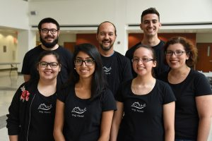

This is the website for the Behavioral Neuroscience lab at Dominican University, affectionately known as the Slug Lab.  The PIs are Irina Calin-Jageman (biology) and Bob Calin-Jageman (psychology), lovers of goofy photos.

Our collaborative lab is focused on understanding the molecular mechanisms of long-term memory.  In plain terms, we want to understand what changes in your brain when you learn something new.

As a model organism, we use *Aplysia californica*–a type of ‘sea slug’ that has become a favorite organism for studying learning and memory.  Why?  *Aplysia* have both short- and long-term memory for basic types of associative and non-associative learning (they can learn simple things and can remember what they learn for a reasonably long time).  We can figure out *how* these animals learn because they have only 20,000 neurons in their entire CNS (compare this to the 1 million or so in a honey bee or the 60-80 billion in your head).  Moreover, *Aplysia* have some of the largest neurons in the animal kingdom, with some neuron diameters reach up to 1mm!  This makes it easier for us to record the electrical activity in *Aplysia* neurons and to harvest them for molecular and cellular analysis.  Best of all, *Aplysia* are hearty creatures, and CNS recordings can take place in semi-reduced right alongside behavioral measurements.

As a model researcher, we train undergraduates in the pleasures, pains, and excitement of independent research.  Though the research may seem daunting, training sea slugs is actually pretty easy to do, and most of our students can make a meaningful contribution to the lab within a few weeks.  This is important because it helps our students focus on the really important parts of science–learning how solve problems, analyze data, and draw reasonable conclusions from this data.  We always try to keep in mind Feynman’s [advice](http://neurotheory.columbia.edu/~ken/cargo_cult.html): “**The first principle is that you must not fool yourself — and you are the easiest person to fool.**”  Thinking of joining the lab?  Drop by Parmer 210 to discuss.
