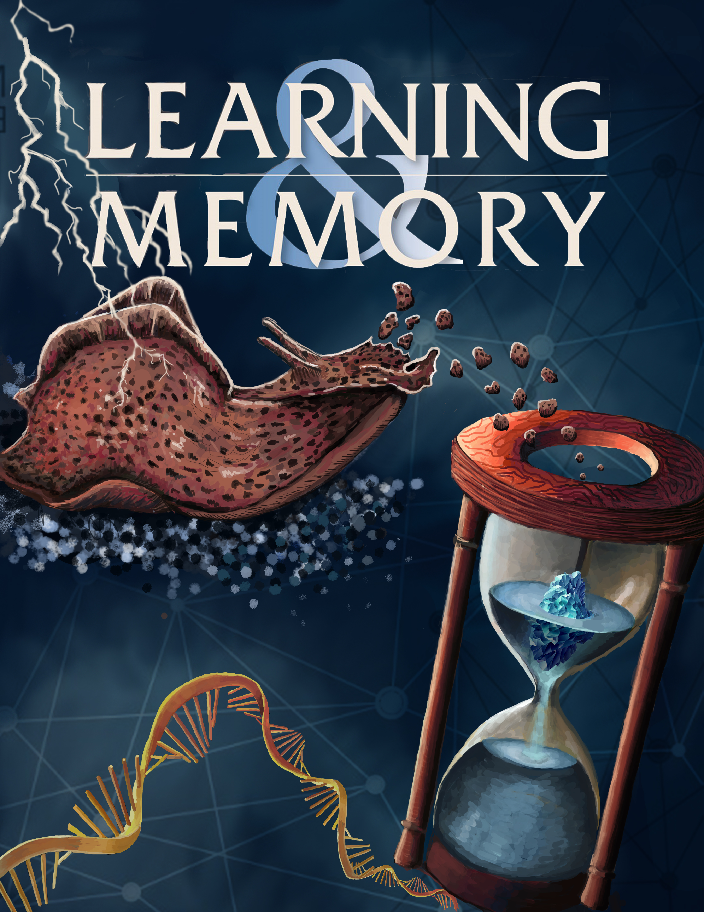
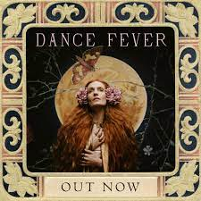

**Gallery**

Over the years, a lot of amazing artwork and images have been generated by students in the Slug Lab. Here's a sample:

compare to the EP cover of Marina and the Diamonds:

Compare to the Florence and the Machine album cover

