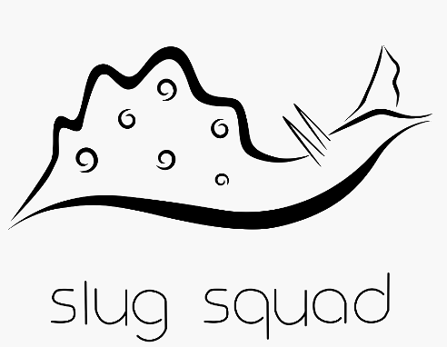

Welcome, to the online home of [Dominican University](https://www.dom.edu)’s Slug Lab.

{fig-alt="Slug Lab logo, a cute aplysia californica" width="327"}

Here you will find all the usual stuff for a lab website (lab personnel, posts about recent papers, etc.). In addition, this site hosts resources from our recent sequencing efforts for *Aplysia californica*:

- [Blast](https://blast.aplysia.online) of our new long-read assembly of the *Aplysia* genome

- [Browser](https://blast.aplysia.online) of our new long-read assembly of the *Aplysia* genome

- Information about the sequencing resources posted here.

- Raw sequencing data you can download to use for your own project.

Below is the blog roll for the lab, with musings, news, publications, etc.
