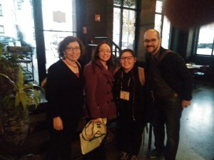
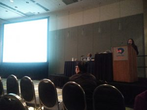
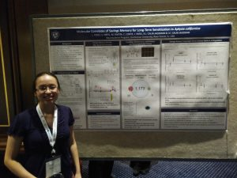

Wow! Our lab just returned from the 2017 Society for Neuroscience meeting.  It was the typical maelstrom of neuroscience–with more than 20,000 neuroscientists bustling about trying to share the latest and greatest about their research.

This turned out to be an especially great year for the Slug Lab.  Leticia Perez, who has been working in our lab for the past two summers, submitted an abstract to present the work she and others in the lab have been doing on forgetting.  We’ve been really excited about the results of this project.  It turns out the SFN organizers were excited, too–they selected Leticia’s abstract for a 10 minute talk during a mini-symposium on the mechanisms of learning and memory.

Leticia absolutely crushed it–she gave a concise, clear, and exciting presentation on what happens in the Aplysia nervous system as a long-term memory is forgotten.  She handled the questions wonderfully, and was soundly congratulated by many researchers in the learning and memory community.  Of the 20,000+ in attendance, I’m willing to be she was the only undergraduate to give a talk at this year’s meeting.  It was \*such\* an accomplishment.

In case that wasn’t enough, Leticia also brought along a poster presenting the research.  She gave the poster at the pre-meeting on molecular and cellular neuroscience and at the undergraduate poster session.  Yes, that means she gave 3 presentations last weekend!  Wow!  And, again, all went wonderfully.

Part of the reason Leticia was able to attend the meeting to earn all this acclaim is that she was awarded an Excel scholarship through Dominican University–this paid her registration, hotel, and airfare to make it affordable to attend the meeting.  She still had to work like crazy to collect the data, refine the presentation, and clear her class schedule to attend.  Lab alumnnus Marissa Rivota also attended–so her and Leticia also got to see the capital and the White house.

We’re so proud of Leticia, and of the many other students who have worked so hard in the lab for the past summers to make this forgetting project such a success.  There will be a paper on it coming out very soon in *Learning and Memory*.  It’s tremendous work to do good science–we’re so happy to have wonderful students who want to get involved and excel.

Below are photos of Leticia giving her talk, giving her poster, and celebrating with me, Irina, and Marissa.  Congrats, Leticia!

