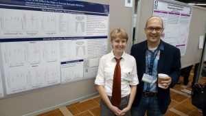
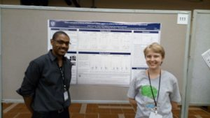

APS was in Chicago this year, so the replicators I have been supervising were out in full force.

Clinton Sanchez presented his replications of a study claiming that analytic thinking promotes religious disbelief. [cite source=’doi’]10.1126/science.1215647[/cite]. His manuscript is having a rough time, but we’re hoping it will be out soon. Clinton is now in a MA program in Clinical Counseling at DePaul. Data from his project is here: <https://osf.io/qc6rh/>

Elle Lehmann presented a poster of her replications of a studies showing that red enhances perceived attractiveness of men rating women [cite source=’doi’]10.1037/0022-3514.95.5.1150[/cite] and women rating men [cite source=’doi’]10.1037/a0019689[/cite] . Elle’s paper is in submission–she found little to no effect for either gender. She’s now working on a meta-anlaysis which has become quite a project, but really interesting. She has graduated and will be applying for a Fullbright in the fall. Data from here project is here: <https://osf.io/j3fyq/>

Last but not least Eileen Moery presented a poster of her replications of a study which claimed that organic food makes you morally judgemental [cite source=’doi’]10.1177/1948550612447114[/cite]. Eileen’s studies were recently published [cite source=’doi’]10.1177/1948550616639649[/cite]. She found little to no effect of organic food exposure on moral judgements. She’s starting an MA program in clinical psych at IIT in the fall!. Data from here project is here: <https://osf.io/atkn7/>

Photos came out a bit blurry (new phone, but crappy camera!).

Elle and me at her poster.

Clinton and Elle at his poster.