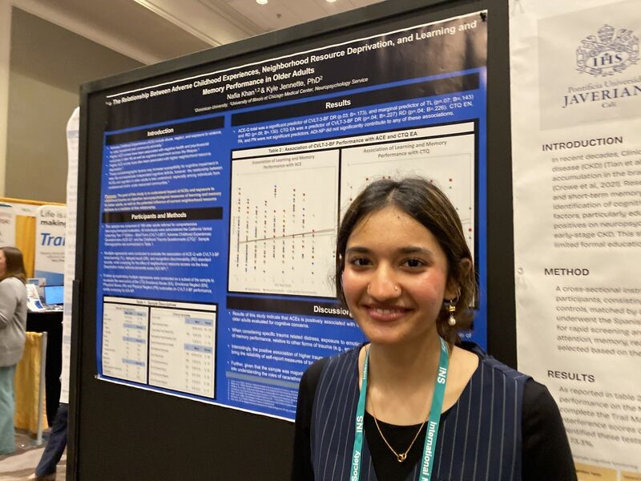

For over a decade the SlugLab has been a proving ground for Dominican University STEM majors to gain hands-on experience conducting neuroscience research. But we’re not the only lab on campus and we’re not the only connection Dominican has for students to get involved with STEM.

Here’s an example: during the summer of 2024, Dominican neuroscience major Nafia Khan completed a Dominican-sponsored research internship with Dr. Kyle Jennette at the UIC neuropsych clinic. Nafia got to learn about neuropsychology, the clinic, and dive into analyzing data that the clinic had collected across a diverse population of patients. Nafia developed a project and it was so strong that it was accepted for presentation at the 2025 International Neuropsychological Society meeting. DU helped fund Nafia to attend. In addition to great traffic at their poster, Nafia attended sessions, volunteered with the conference, and did lots of amazing networking. Photo below!

Here’s the title/citation for Nafia’s presentation:

> Khan, N., Orleans, N., Olu-Lawal, O., Singam, M. Dumett Torres, E., Phillips, M., Cerny, B., Soble, J., Pliskin, N., Song, W. & Jennette, K. (2025, February) *The relationship between adverse childhood experiences, neighborhood resource deprivation, and learning and memory performance in older adults with primary memory complaints*. Abstract accepted for presentation at annual meeting of the International Neuropsychological Society, New Orleans, LA.

Congrats to Nafia, to Dr. Jennette’s lab, and to all the folks at DU who helped make this happen. Just one example, but a great one!

