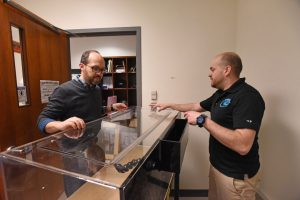
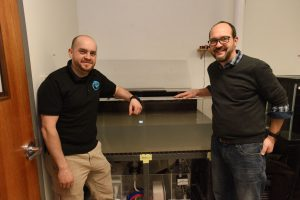
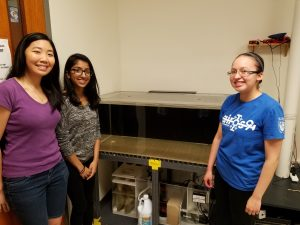

The slug lab is kicking off summer research with a brand new aquarium and mixing station for housing *Aplysia*.  It’s a great upgrade and an even better story that involves some strong DU connections.

The slug lab has been running for 10 years now (gasp!) and our aquariums were showing signs of wear.  Like the wooden stand on one of the tanks starting to collapse.  Pretty strong sign.  (fortunately a student was in the room as the tank started to tip; she called for help, we drained the tank, and disaster was averted).  By fall of 2017 we were down to just 1 tank and worried about how we’d get back to 2 in time for our blitz of summer research.

**DU Connection Number 1**: In late fall 2017 we were thrilled to receive a McNichols grant from a Dominican Alumni.  This grant was specifically targeted at funding science education at Dominican. We had some meetings and identified several great projects that could be helped by this generous gift–work to improve our greenhouse, a new measurement instrument for the PChem lab, and… a new tank for the slug lab.  Hooray, and a big thanks to the McNichols family.

**DU Connection Number 2**: We knew we wanted to upgrade beyond a hobbyist tank.. but there were so many options and it was difficult to determine the best path forward.   Enter DU connection #2, Romney Cirillo and his company [Something Fishy](http://www.fishyonline.com/Something_Fishy/Something_Fishy_Chicago.html).  Romney was a business major at Dominican.  When he graduated he wasn’t entirely sure what to do.  But he remembered Al Rosenbloom’s advice to find something he was passionate about and to find a way to make it a life’s work.  Combining that advice with a great entrepreneurship class he had completed, Romney decided to start a business related to his life-long interest in raising exotic fish.  He recruited a great friend as a business partner.  Something Fishy was quickly born as a full-service aquarium design and maintenance company.   Since its founding, Something Fishy has thrived by providing great service and incredible craftsmanship.  Things were going well, so Romney started giving back to DU–installing a gorgeous salt-water tank in Parmer hall.  That’s how I met Romney and got to know Something Fishy.  So, naturally, when it came time for a new tank, Romney was the first person to call.  Thank goodness for these strong DU connections.

**The amazing tank**.  Romney and Mike visited the slug lab, walked us through options and designed a customized setup exactly suited for our needs:

* a bigger tank with a better filter system
* lower to the ground with a huge lid to make experimental access easier (our students say thank you!)
* incredibly tough and corrosion resistant tank stand (no more collapses from wooden stands)
* better insulation to make our chillers work less hard
* **and**an incredible mixing station for making salt water, complete with a DI line and an auto-shutoff (no more leaks down into the classroom below).

We just finished our first round of experiments with animals housed in the new tank… wow!  Even on the day of shipment the tank water stayed at crystal clear.  Good water -> healthy animals -> a good platform for good science.

Not only is the tank \*way\* better than what we had, it looks amazing–the install is clean and sharp; it really looks space age.  Best of all, the cost was not astronomical.

So – thanks to two great DU alum we have a great new home for our animals.

Romney (right) showing me the features of the tank on install day.

Here are some photos, but they don’t really do the tank justice for how cool and clean it all looks.

First fillup. Water has just had salt added.

Smiles even on tank cleaning day! The new tank setup is soooo sharp. (Melissa, Ushma, and Leticia… there are slugs in the tank, but all are hiding in the back).