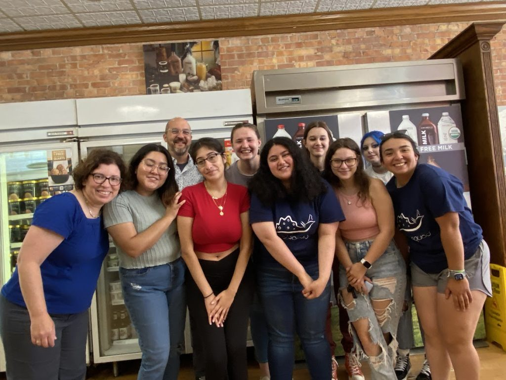

Last week, the SlugLab celebrated the successful wrap up of the Summer 2023 research season.

There will be many posts to come discussing the rather amazing work we completed this summer: intriguing data on memory manipulation, a transcriptional time course for a very long-lasting form of memory, and a raft of amazing sequencing projects… it’s going to take a while to process all we’ve done.

More important than the work was the way we did it: with lots of laughs, team spirit, and rigor.

SlugLab 2023 — Special thanks to our photographer, 7-year-old Mia C-J!