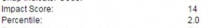

Woot! The Slug Lab has just been awarded a 3-year R15 grant from NIH to study the transcriptional mechanisms of sensitization memory and decay. What does that mean? It means that Irina and I will continue to be working our a\*\*’ off trying to understand what genes are activated as an animal stores a long term memory, and even more importantly, as a long-term memory is forgotten.

Here’s the screen grab from ERA commons:  
\*

Big thanks to our dedicated and amazing students, and to the incredibly supportive colleagues and administrators we have here at Dominican University. We’re looking forward to crushing it with this project.

\*Technically, that’s not the actual notice of the award, but of our priority score from a peer review of our grant proposal by a panel of esteemed scientists in the field. We got the award letter via email last week.