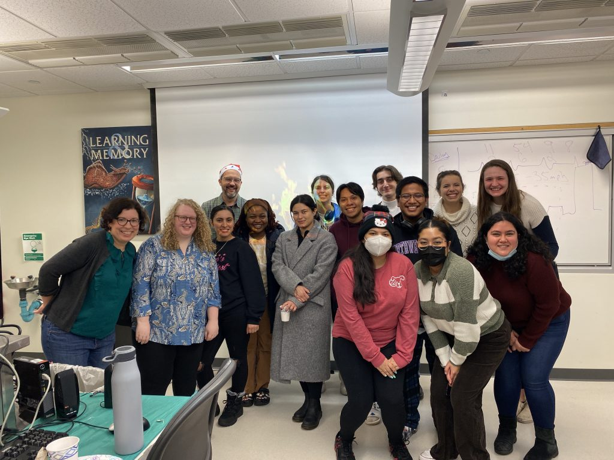

Yesterday (12/14) was our slug lab and neuroscience holiday party. Please ignore the fact that we had food in the lab; focus instead on the festive fun time (complete with a crackling fireplace broadcast on the lab projector… toasty!).

We celebrated the graduation of our mid-term neuroscience majors

* Steven Proutsos, who is graduating with a 4.0! (well, hopefully, depending on how he does on C-J’s molecular biology final) and just scheduled his MCAT
* Christian Gonzalez, who just accepted a job working as a research technician in a neuroscience lab at Rush medical school!

We also celebrated birthdays, off-campus departures, successful TA-ships, the holiday, and anything/everything else worth celebrating about our wonderful lab students and neuroscience majors (a few non-majors even snuck in; the more the merrier!)

Here was the scene:

CJ, Fiona, Stephanie, Me, Gold, Michele, Live, Christian, Jaqueline, Stephen, Brian, Jas, Delaney, Theresa and Zayra!