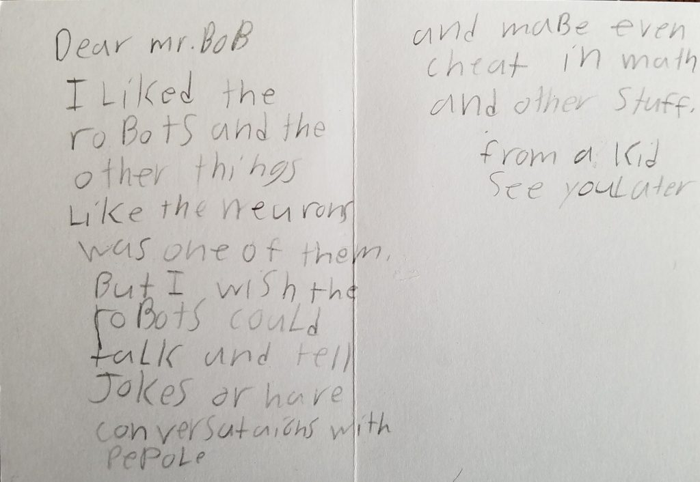
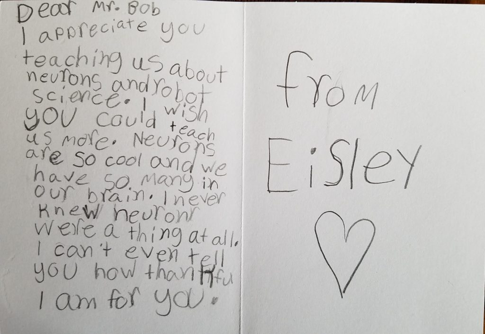
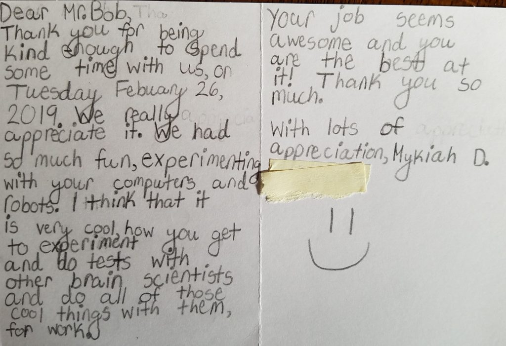

At the end of February I (Dr. Bob) visited a local elementary school as part of the Oak Park Educational Foundation’s [Science Alliance Program](https://www.opef.org/programs/science-alliance/).

I was matched up with Sue Tressalt’s Third Grade Class at [Irving Elementary](http://www.op97.org/irving). For an activity, I brought along the neuroscience program’s collection of Finch Robots, a set of laptops, and the [Cartoon Network simulator](https://github.com/rcalinjageman/cartoon_network) I have been developing (Calin-Jageman, 2017, 2018). I introduced kids to the basic rules of neural communication, and they explored Cartoon Network, learning how to make brains to get the Finch Robots to do what they wanted (e.g. avoid light, sing when touched, etc.). It was a great class, and a ton of fun.

I’m proud of Cartoon Network, and the fact that it can make exploring brain circuitry *fun*. It’s simple enough that the kids were able to dive right in (with some help), yet complex enough that really interesting behaviors and dynamics can be modelled.

As a kid, my most formative experience in science was learning [logo](https://en.wikipedia.org/wiki/Logo_(programming_language)), the programming language developed by Seymour Papert and colleagues at MIT. Logo was fun to use, and it made me *need/want* key programming concepts. I clearly remember sitting in the classroom writing a program to draw my name and being frustrated at having to re-write the commands to make a B at the end of my name when I had already typed them out for the B at the beginning of my name. The teacher came by and introduced me to functions, and I remember being so happy about the idea of a “to b” function, and I immediately grasped that I could write functions for every letter once and then be able to have the turtle type anything I wanted in no time at all.

Years later I read *[Mindstorm](http://worrydream.com/refs/Papert%20-%20Mindstorms%201st%20ed.pdf)s* and it remains, to my mind, one of the most important books on pedagogy, teaching, and technology. Papert applied Piaget’s model of children as scientists (he had trained with Piaget). He believed that if you can make a *microworld* that is fun to explore, children will naturally need, discover, and understand deep concepts embedded in that world. That’s what I was experiencing back in 2nd grade–I desperately needed functions, and so the idea of them stuck with me in a way that they never would in an artificial “hello world” type of programming exercise. Having been a “logo kid” it was amazing to read *Mindstorms* and recognize Papert’s intentionality behind the experiences I had learning Logo.

Anyways, bringing Cartoon Network to an elementary school for a day gave me a great feeling of carrying on a tiny piece of Papert’s legacy. The insights kids develop in just an hour of playing with neural networks are amazing–the idea of a recurrent loop made immediate sense to them, and that also sets up the idea that both excitation *and* inhibition are important. And, like in Logo, the kids were excited to explore–to know that their experience was not dependent on getting the ‘right’ answer but on trying, observing, and trying again.

The day was fun and even better I received a whole stack of thank-you cards this week. Reading through them has kept a smile on my face all week. Here’s a sample.

This kid has some great ideas for the future of AI

“I never knew neurons were a thing at all”–the joy of discovery

“Your job seems awesome and you are the best at it”—please put this kid on my next grant review panel.

1. Calin-Jageman, R. (2017). Cartoon Network: A tool for open-ended exploration of neural circuits. *Journal of Undergraduate Neuroscience Education : JUNE : A Publication of FUN, Faculty for Undergraduate Neuroscience*, *16*(1), A41–A45. Retrieved from <https://www.ncbi.nlm.nih.gov/pubmed/29371840>
2. Calin-Jageman, R. (2018). Cartoon Network Update: New Features for Exploring of Neural Circuits. *Journal of Undergraduate Neuroscience Education : JUNE : A Publication of FUN, Faculty for Undergraduate Neuroscience*, *16*(3), A195–A196. Retrieved from <https://www.ncbi.nlm.nih.gov/pubmed/30254530>