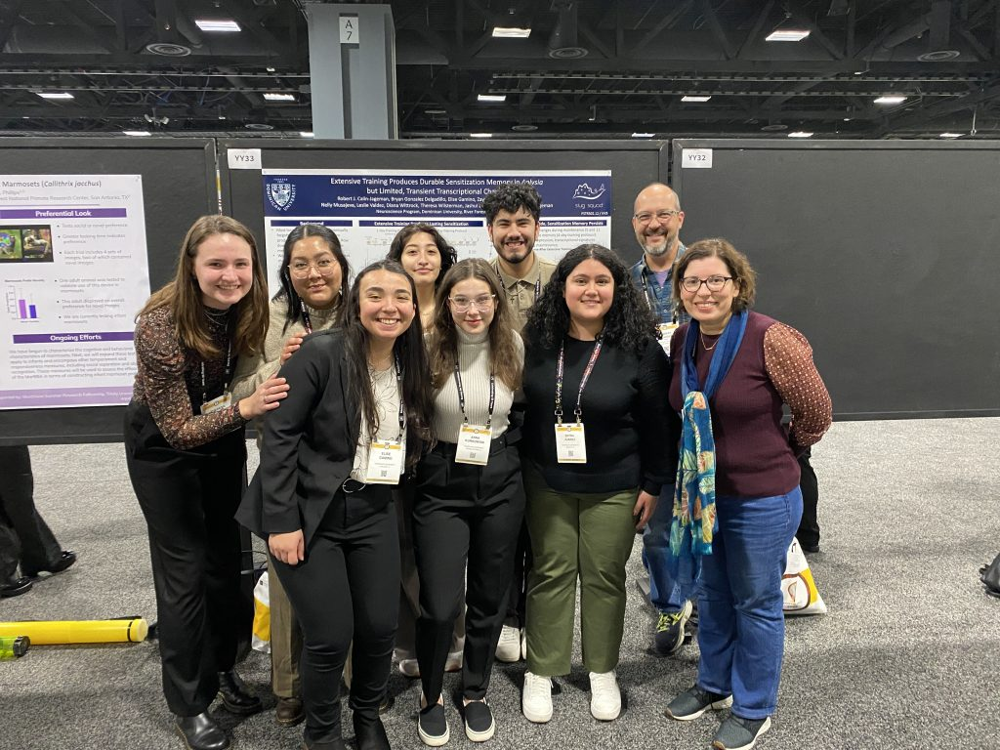
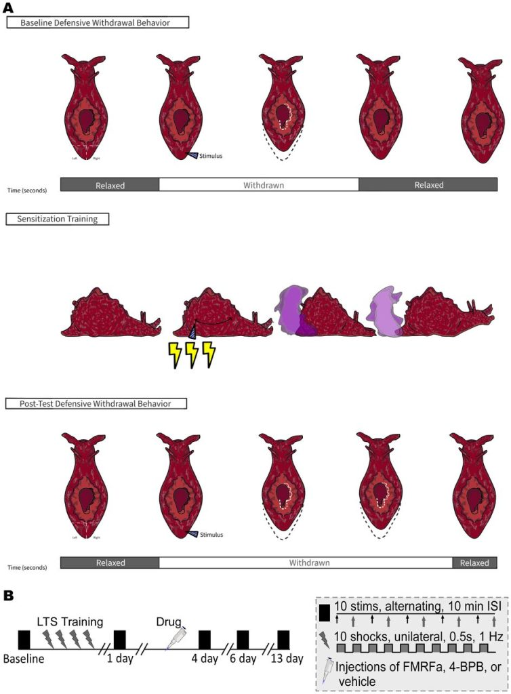

The Sluglab’s latest paper is now live at eNeuro! You can find it here: ​(Calin-Jageman et al., 2024)​.

We’ve already blogged about the paper: it tested our hypothesis that we could manipulate forgetting by changing signalling of an inhibitory peptide neurotransmitter called FMRF-amide. Our hypothesis was informed by the fact that we observe a huge and long-lasting increase in FMRF-amide transcription when animals acquire a long-term sensitization memory ​(Conte et al., 2017; Patel et al., 2018)​. Given that FMRF-amide serves to inhibit withdrawal reflexes, we reasoned that it represents an active-forgetting process that could be manipulated.

Our results were equivocal. On the one hand, we found that blocking FMRF-amide did, indeed slow down forgetting. On the other hand, we obtained a very wide confidence interval: we can’t be sure it is a large/replicable effect. Moreover, boosting FMRF-amide did not seem to speed up foregetting, as we predicted. So: a very intriguing finding we’ll need to follow-up on, but not the most clear-cut evidence. It was great that we pre-registered our study and published at a journal that is open to *all* well-conducted results, so we didn’t have to feel any pressure to “pretty up” these somewhat ambiguous results or to make strong claims from what ended up being somewhat noisy data.

The best thing about this project was the great DU students who made the whole project happen in just one summer. Amazing! Here’s the crew celebrating at SFN this fall. Congrats!

Oh, and one of these great students, Theresa Wilsterman, made this fantastic illustration for the paper (and just got a job at Rush Medical!)

1. Calin-Jageman, R. J., Gonzalez Delgadillo, B., Gamino, E., Juarez, Z., Kurkowski, A., Musajeva, N., … Calin-Jageman, I. E. (2024). Evidence of Active-Forgetting Mechanisms? Blocking Arachidonic Acid Release May Slow Forgetting of Sensitization in*Aplysia*. Society for Neuroscience. doi: [10.1523/eneuro.0516-23.2024](https://doi.org/10.1523/eneuro.0516-23.2024)
2. Conte, C., Herdegen, S., Kamal, S., Patel, J., Patel, U., Perez, L., … Calin-Jageman, I. E. (2017). Transcriptional correlates of memory maintenance following long-term sensitization of *Aplysia californica*. Cold Spring Harbor Laboratory. doi: [10.1101/lm.045450.117](https://doi.org/10.1101/lm.045450.117)
3. Patel, U., Perez, L., Farrell, S., Steck, D., Jacob, A., Rosiles, T., … Calin-Jageman, I. E. (2018). Transcriptional changes before and after forgetting of a long-term sensitization memory in Aplysia californica. Elsevier BV. doi: [10.1016/j.nlm.2018.09.007](https://doi.org/10.1016/j.nlm.2018.09.007)