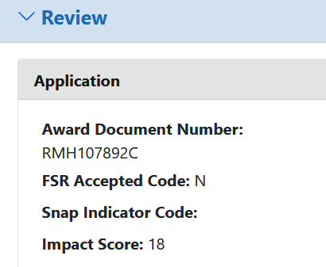

Doing science isn’t always cheap. The sluglab has been very fortunate to have had multiple rounds of funding from the National Institute of Health to support our research. Specifically, we’ve been supported by R15 grants, a grant program designed specifically for undergraduate-focused labs. These grants are much smaller than the R01s obtained at larger universities (an R01 can be for up to $1 million/year for 5 years; an R15 is a total of $300,000 over 3 years), but they provide an opportunity to fund research with undergraduate researchers (one big complaint about this program, though, is the short timeline — R15s are on a much shorter cycle even though it typically takes \*more\* time to finish projects in an undergrad-focused lab).

The sluglab has had the good fortune to have strong R15 funding from the NIH. We got started in 2009 with an R15 to study long-term habituation. That project went well ​(Holmes et al., 2014)​, but also showed us that we could get more accomplished studying long-term sensitization. So in 2014 we applied for and received funding to study the formation and forgetting of sensitization memory. This project went so well that we renewed it in 2018.

This year (2024), in February, we applied to renew the project again. Putting together a grant application is \*tough\* — you have to review your progress from the previous grant and then make a good case that you have additional important, clear research questions along with the ability to answer those questions. Fortunately, our last round of funding was really productive — we mapped the transcriptional bases of savings memory ​(Rosiles et al., 2020)​, found experimental validation for our dual-process model of forgetting ​(Calin-Jageman, Gonzalez Delgadillo, et al., 2024; Perez, Patel, Rivota, Calin-Jageman, & Calin-Jageman, 2017)​, and wrote a new synthesis on the transcriptional mechanisms of sensitization ​(Calin-Jageman, Wilsterman, & Calin-Jageman, 2024)​. We also worked hard to develop some really strong new research projects, proposing to compare forgettable and unforgettable forms of sensitization memory with single-cell resolution and to test our theory of forgetting at the cellular level. With a ton of coffee and work, we developed our renewal application and sent it in.

And then we waited. Submission in February gets your grant reviewed in mid-June. You get your scores within a few days, then written comments within a few weeks, then there is a council meeting several months later at which actual funding decisions are made. It is quite a process.

It’s now July, so we still have a ways to go before council and the official decision… but we are excited to share that our grant was *very* highly scored — in the top 4% of grants reviewed this cycle. That’s not a guarantee, but we can still feel pretty good about ultimately being funded. So: huzzah — the sluglab will have the funding needed to continue training both sea slugs and undergrads, at least for the next several years to come. Can’t wait to see all we can accomplish on this next grant.

1. Calin-Jageman, R. J., Gonzalez Delgadillo, B., Gamino, E., Juarez, Z., Kurkowski, A., Musajeva, N., … Calin-Jageman, I. E. (2024). Evidence of Active-Forgetting Mechanisms? Blocking Arachidonic Acid Release May Slow Forgetting of Sensitization in*Aplysia*. Society for Neuroscience. doi: [10.1523/eneuro.0516-23.2024](https://doi.org/10.1523/eneuro.0516-23.2024)
2. Calin-Jageman, R. J., Wilsterman, T., & Calin-Jageman, I. E. (2024). Transcriptional Regulation Underlying Long-Term Sensitization in Aplysia. Oxford University Press. doi: [10.1093/acrefore/9780190264086.013.499](https://doi.org/10.1093/acrefore/9780190264086.013.499)
3. Holmes, G., Herdegen, S., Schuon, J., Cyriac, A., Lass, J., Conte, C., … Calin-Jageman, R. J. (2014). Transcriptional analysis of a whole-body form of long-term habituation in*Aplysia californica*. Cold Spring Harbor Laboratory. doi: [10.1101/lm.036970.114](https://doi.org/10.1101/lm.036970.114)
4. Perez, L., Patel, U., Rivota, M., Calin-Jageman, I. E., & Calin-Jageman, R. J. (2017). Savings memory is accompanied by transcriptional changes that persist beyond the decay of recall. Cold Spring Harbor Laboratory. doi: [10.1101/lm.046250.117](https://doi.org/10.1101/lm.046250.117)
5. Rosiles, T., Nguyen, M., Duron, M., Garcia, A., Garcia, G., Gordon, H., … Calin-Jageman, R. J. (2020). Registered Report: Transcriptional Analysis of Savings Memory Suggests Forgetting is Due to Retrieval Failure. Society for Neuroscience. doi: [10.1523/eneuro.0313-19.2020](https://doi.org/10.1523/eneuro.0313-19.2020)