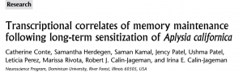

Under the right circumstances, a memory can last a lifetime.  Yet at the molecular level the brain is constantly in flux: the typical protein has a half-life of only a few hours to days; for mRNA a half-life of 2 days is considered extraordinarily long.   If the important biological molecules in the brain are constantly undergoing decay and renewal, how can memories persist?

The Slug Lab has a bit of new light to shed on this issue today.  We’ve just published the next in our series of studies elucidating the transcriptional changes that accompany long-term memory for sensitization in *Aplysia.* In a previous paper, we looked at transcription 1 hour after a memory was induced, a point at which the nervous system is first encoding the memory.  We found that there is rapid up-regulation of about 80 transcripts, many of which function as transcription factors (Herdegen, Holmes, Cyriac, Calin-Jageman, & Calin-Jageman, 2014).

For the latest paper (Conte et al., 2017), we examined changes 1 day after training, a point when the memory is now being maintained (and will last for another 5 days or so).  What we found is pretty amazing.  We found that the transcriptional response during maintenance is very complex, involving up-regulation of >700 transcripts and down-regulation of <400 transcripts.  Given that there are currently 21,000 gene models in the draft of the *Aplysia* genome, this means more than 5% of all genes are affected (probably more due to the likelihood of some false negatives and the fact that our microarray doesn’t cover the entire *Aplysia* genome).   That’s a lot of upheaval… what exactly is changing?  It was daunting to make sense of such a long list of transcripts, but we noticed some very clear patterns.  First, there is regulation influencing growth: an overall up-regulation of transcripts related to producing, packaging, and transporting proteins and a down-regulation of transcripts related to catabolism.  Second, we observed lots of changes which could be related to meta-plasticity.  Specifically, we observed down regulation in isoforms of PKA, in some serotonin receptors, and in a phosphodiesterase.  All of these changes might be expected to *limit* the ability to induce sensitization, which would be consistent with the BCM rule (once synapses are facilitated, raise the threshold for further facilitation).  (Bienenstock, Cooper, & Munro, 1982).

One of the very intriguing findings to come out of this study is that the transcriptional changes occuring during encoding are very distinct from those occuring during maintenance.  We found only about 20 transcripts regulated during both time points.  We think those transcripts might be especially important, as they could play a key regulatory/organizing role that spans from induction through maintenance.  One of these transcripts encoded a peptide transmitter called FMRF-amide.  This is an inhibitory transmitter, which raises the possibility that as the memory is encoded, inhibitory processes are simultaneously working to limit or even erode the expression of the memory (a form of active forgetting).

There are lots of exciting pathways for us to explore from this intriguing data set.  We feel confident heading down these paths because a) we used a reasonable sample size for the microarray, and b) we found incredibly strong convergent validity in an independent set of samples using qPCR.

This is a big day for the Slug Lab, and a wonderful moment of celebration for the many students who helped bring this project to fruition: Catherine Conte (applying to PT schools), Samantha Herdegen (in pharmacy school), Saman Kamal (in medical school), Jency Patel (about to graduate), Ushma Patel (about to graduate), Leticia Perez (about to graduate), and Marissa Rivota (just graduated).  We’re so proud of these students and so fortunate to work with such a talented and fun group.

Bienenstock, E., Cooper, L., & Munro, P. (1982). Theory for the development of neuron selectivity: orientation specificity and binocular interaction in visual cortex. *The Journal of Neuroscience : The Official Journal of the Society for Neuroscience*, *2*(1), 32–48. [[PubMed](https://www.ncbi.nlm.nih.gov/pubmed/7054394)]

Conte, C., Herdegen, S., Kamal, S., Patel, J., Patel, U., Perez, L., … Calin-Jageman, I. E. (2017). Transcriptional correlates of memory maintenance following long-term sensitization of Aplysia californica. *Learning and Memory*, *24*, 502–515. doi: [10.1101/lm.045450](https://dx.doi.org/10.1101/lm.045450)117  [[Source](http://learnmem.cshlp.org/content/24/10/502)]

Herdegen, S., Holmes, G., Cyriac, A., Calin-Jageman, I. E., & Calin-Jageman, R. J. (2014). Characterization of the rapid transcriptional response to long-term sensitization training in Aplysia californica. *Neurobiology of Learning and Memory*, *116*, 27–35. doi: [10.1016/j.nlm.2014.07](https://dx.doi.org/10.1016/j.nlm.2014.07)009