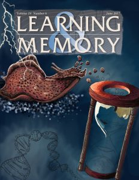

Most long-term memories are ‘forgotten’–meaning that it becomes harder and harder to recall the memory.  Psychologists have long known, though, that forgetting is complex, and that fragments of a memory can remain.  For example, even after a memory seems forgotten it can be easier to re-learn the same material, something called ‘savings memory’.  That suggests that there is at least some fragment of a memory that persists in the brain even after it seems forgotten…but what?

Today our lab has [published a paper](http://learnmem.cshlp.org/content/25/1/45.abstract) shedding a bit of light on this long-standing mystery (Perez, Patel, Rivota, Calin-Jageman, & Calin-Jageman, 2017).  We tracked a sensitization memory in our beloved sea slugs.  As expected, memories faded–within a week animals had no recall of the prior sensitization.  Even more exciting, we found similar fragments of memory at the molecular level–there was a small set of genes very strongly regulated by the original training even though recall had fully decayed.

Why?  Do these persistent transcriptional changes help keep a remnant of the memory going?  Or are they actually doing the work of fully erasing the memory?  Or do they serve some other function entirely (or no function at all)?  These are some of the exciting questions we now get to investigate.  But for now, we have these fascinating foothold into exploring what, exactly, forgetting is all about in the brain.

As usual, we are enormously proud of the undergraduate students who helped make this research possible: Leticia Perez, Ushma Patel, and Marissa Rivota. Ushma, who wants to do science illustration, is making an incredible piece of artwork representing these findings.  A draft is shown above.  She submitted it for the cover of the journal, but sadly they journal selected a different image (boo!).  Still, a very exciting and proud day for the slug lab!

Perez, L., Patel, U., Rivota, M., Calin-Jageman, I. E., & Calin-Jageman, R. J. (2017). Savings memory is accompanied by transcriptional changes that persist beyond the decay of recall. *Learning & Memory*, *25*(1), 45–48. doi: [10.1101/lm.046250](https://dx.doi.org/10.1101/lm.046250)117