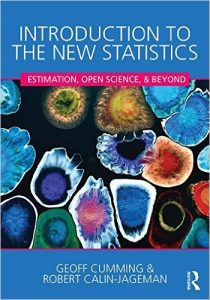

Can a statistics textbook change the world? Maybe yes! At least that’s the aspiration behind [*Introduction to the New Statistics: Estimation, Open Science and Beyond*](http://www.amazon.com/Introduction-New-Statistics-Estimation-Science/dp/1138825522/), a new textbook by Geoff Cumming and yours truly [cite source=’isbn’]978-1138825529[/cite][](http://calin-jageman.net/lab/wp-content/uploads/2016/04/51h9QryV00L._SX348_BO1204203200_.jpg)

How can a statistics textbook change the world? By teaching the estimation approach to data analysis–one that emphasizes confidence intervals, replication, and meta-analysis. The estimation approach is vast improvement over Null Hypothesis Significance Testing. Students find estimation easier to learn and it supports better inference. Hopefully, this book will be an important step in the ongoing battle to abolish p values.

Switching to estimation is not enough, though. Students of research also need to learn the new Open Science practices that are evolving to enhance research rigor: pre-registration, Open Data, and Open Materials. So the textbook is also the first to teach these essential practices from the start.

To sum it up, Geoff and I believe that this is a unique book in a large sea of statistics texts–one which we hope will inspire the next generation of researchers who will be raised from the start on good statistical and methodological practices. Perhaps the replication crisis will fade into the

The book is now available for pre-order on Amazon. It should be published by August, 2016–which is running just a bit late for fall adoptions. If you’d like a desk copy, shoot me an email or leave a comment.