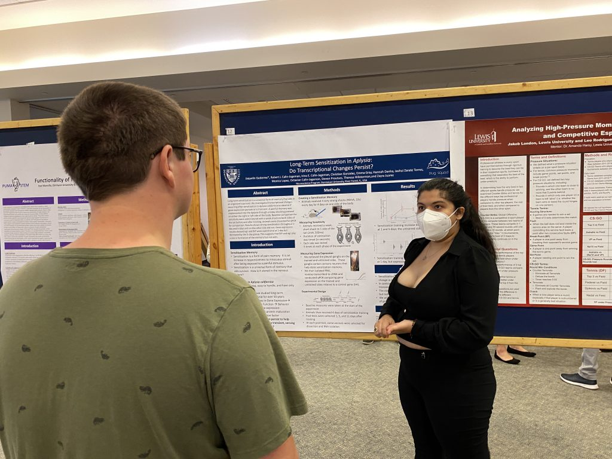
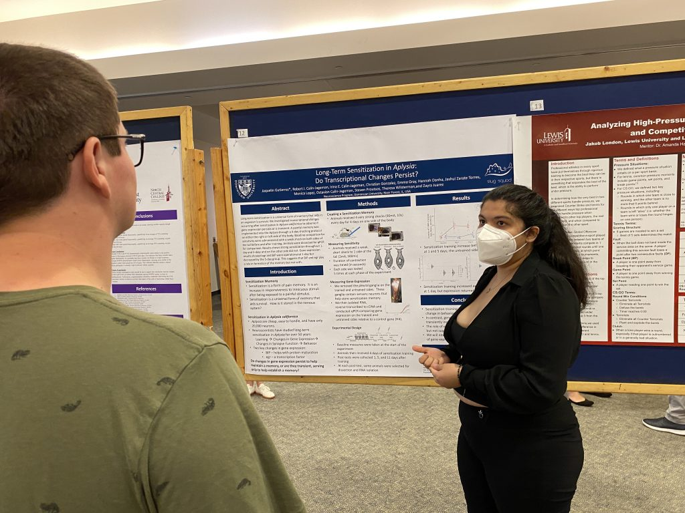
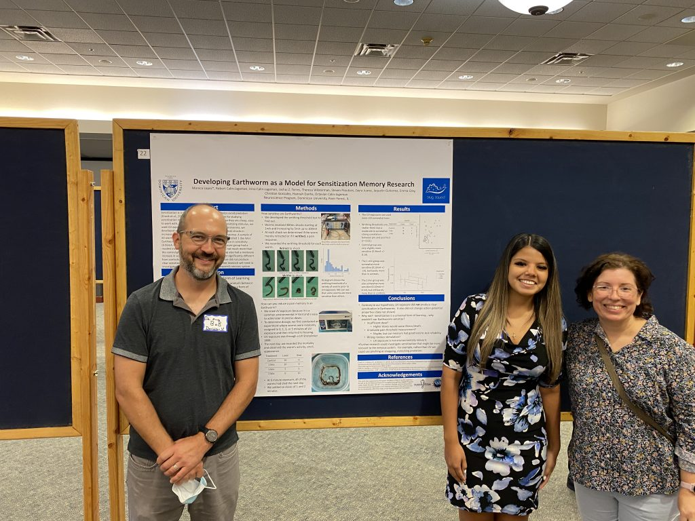
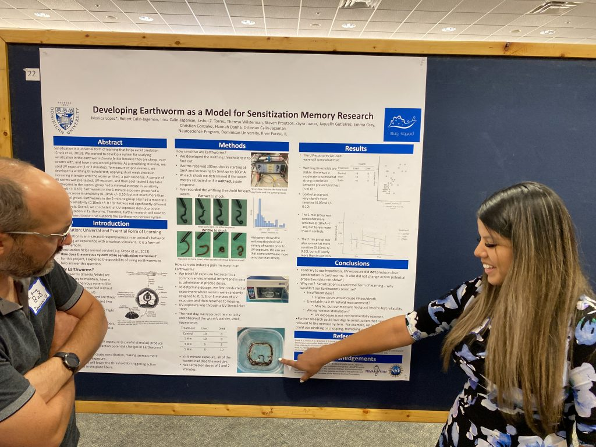
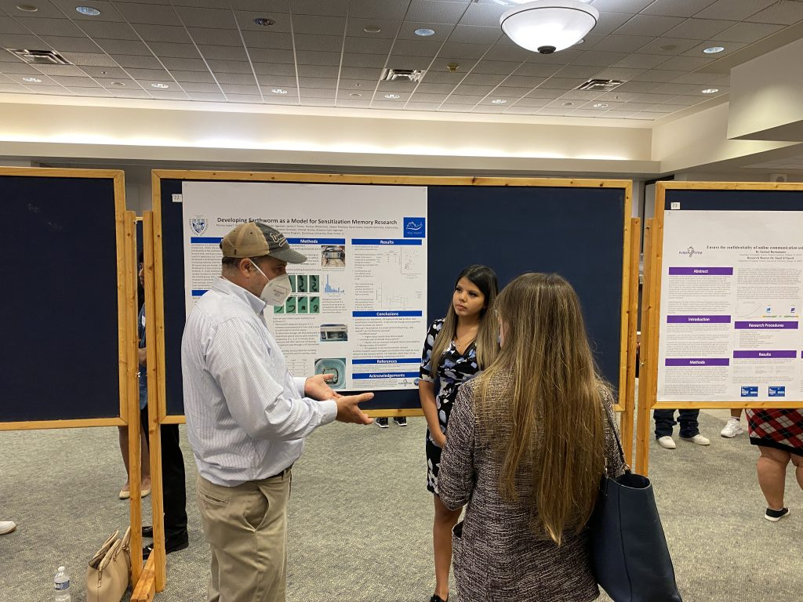
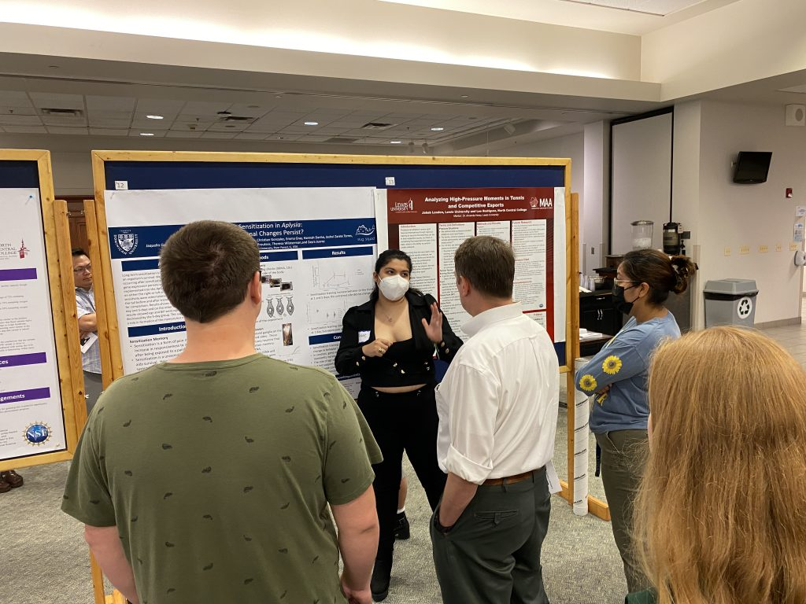
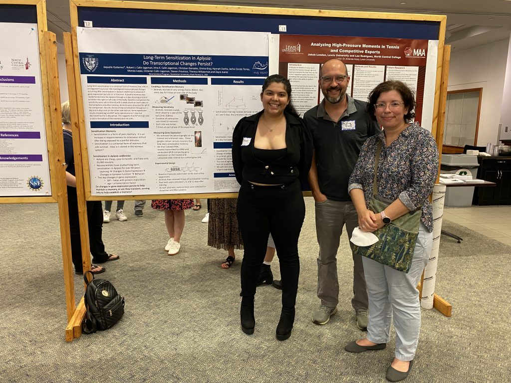
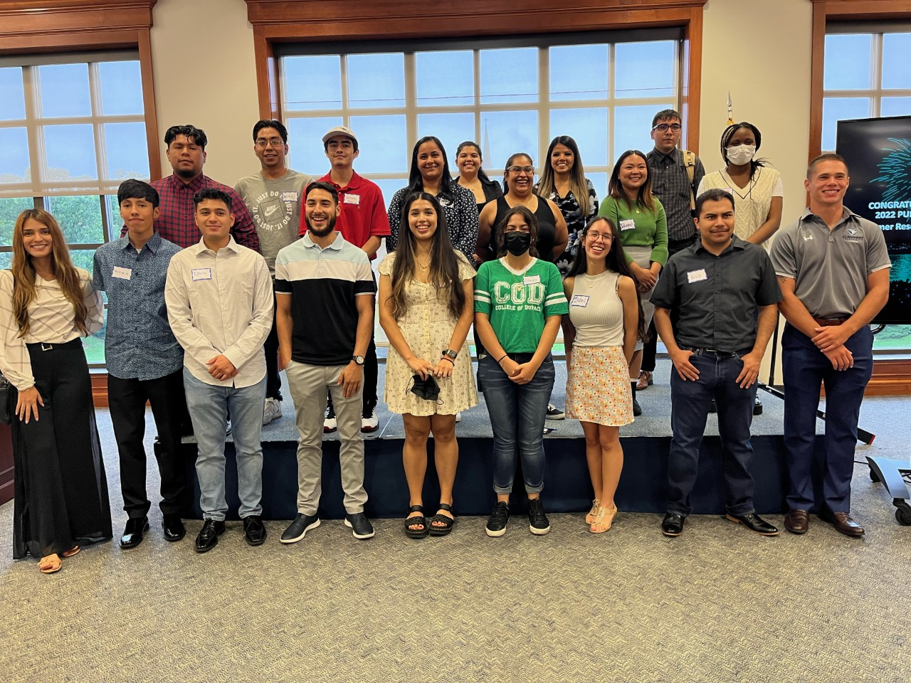

Yesterday, two Slug lab members had their first chance to present their ongoing research projects, premiering their work at the 2022 [PUMA-STEM](https://www.elmhurst.edu/academics/research/puma-stem/about-puma-stem-and-lsamp/) summer research conference:

* Jaqueline Gutierrez presented work on very long-lasting sensitization in *Aplysia*
* Monica Lopez presented work on developing earthworms to study long-term sensitization

It was a great event, and both Jaqueline and Monica did themselves proud–they had really nicely designed posters, presented with confidence, and did a fantastic job fielding question.

Go slug lab!

* 
* 
* 
* 
* 
* 
* 
* 