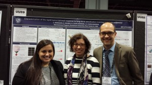

The Sluglab went to Washington D.C. for the 2014 Meeting of the Society for Neuroscience. This is either the 13th or 14th time Irina and I have been. Despite the mileage, we had a great meeting, and enjoyed seeing Sami shine in her first big-time presentation of her work in the lab. Good work, Sami!

