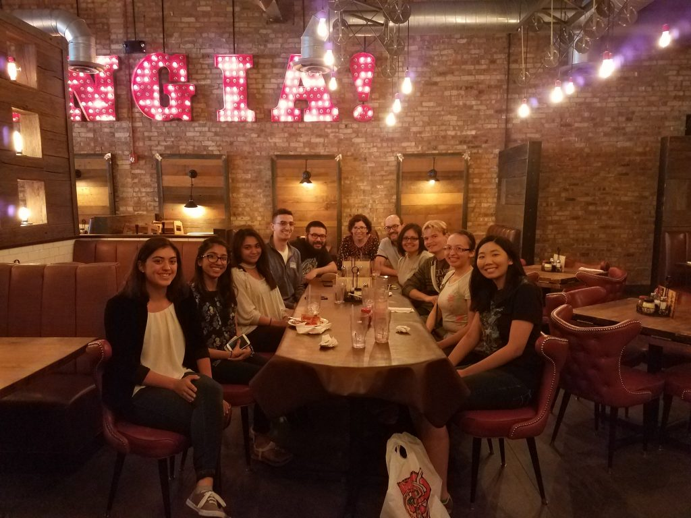

Summer is here, so the Slug Lab is running full speed.

We’re lucky to be joined once again by a really talented and dedicated team of students.  Here’s most of us at a pizza party to inaugurate a summer of research.  

From far left we have

* Kayla Hall, joining us from Amherst for the summer
* Ushma Patel, who has graduated but will stay in the lab for the start of the summer (and then on to study biomedical illustration at UIC)
* Athira Jacob, lab alum now studying for her MCAT
* Derek Steck, lab alum who this summer will be in the UCLA summer research program this summer
* Steven Farrell, who has graduated but is also sticking with the lab for part of the summer while prepping for the MCAT
* Dr C-J and myself (end of the table)
* Tanya Rosiles, new lab member
* Everett Krause, new lab member
* Leticia Perez, lab alum sticking around for part of the summer before heading to UofI for veterinary medicine
* Melissa Nguyen, new lab member and post-bac student

And not yet in the photo but planning on joining when she returns from Ireland: Shannon Wilcox

I hope I don’t jinx anything when I say that we’re off to a great start, with a very successful round of behavioral experiments and RNA isolations.  Looking forward to another great slug lab summer.