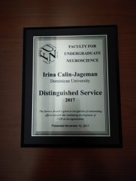

At this year’s Society for Neuroscience meeting, Irina and I were honored for our contributions to the Faculty for Undergraduate Neuroscience (FUN).  Specifically, we were both given the annual Distinguished Service Award.  The honors were bestowed for our work organizing the FUN conference this past summer and for other work supporting the mission of undergraduate neuroscience education.

We’re so fortunate to be a part of FUN–it’s our favorite people all working towards a mission that is so very important.  Thanks for the great honor, and we’re looking forward to staying very involved with FUN.

Here’s a photo of Irina’s award.

