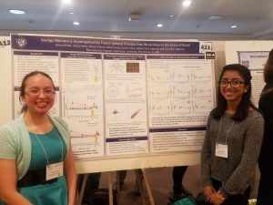

So pleased and proud to announce that Leticia Perez and Ushma Patel have won first place in the Chicago Society for Neuroscience undergraduate poster competition.   Congrats Leticia and Ushma on a great presentation on the work you’ve been doing in the slug lab on the transcriptional correlates of forgetting and savings memory.

Leticia and Ushma are following up their spectacular win with exciting post-graduation plans.  Leticia is enrolling at the University of Illinois School of Vetrinary Medicine (and had her choice of programs!).  Ushma is enrolling at UIC’s prestigious medical illustration MA program (and also had her choice of programs!).  Congrats to both on all the hard work they put into collecting data, analyzing results, and presenting their exciting research.

Want to know more about the research Leticia and Ushma presented?  See their paper in *Learning and Memory*here: (Perez, Patel, Rivota, Calin-Jageman, & Calin-Jageman, 2017)

Not to brag, but this is the 3rd time a DU student has placed in this competition in the past 10 years (Kristine Bonnic had a 3rd place win and Tim Lazicki had a first place win).  That means DU neuroscience students have earned 1/3 of all the awards given out for undergraduate research by the Chicago Society for Neuroscience–an organization that includes Northwestern, Loyola, University of Chicago, DePaul, Midwestern, Roosevelt, North Central, and more…. relative to our student body we’re punching way above our weight!

Perez, L., Patel, U., Rivota, M., Calin-Jageman, I., & Calin-Jageman, R. (2017). Savings memory is accompanied by transcriptional changes that persist beyond the decay of recall. *Learning & Memory (Cold Spring Harbor, N.Y.)*, *25*(1), 45–48. [[PubMed](https://www.ncbi.nlm.nih.gov/pubmed/29246980)]