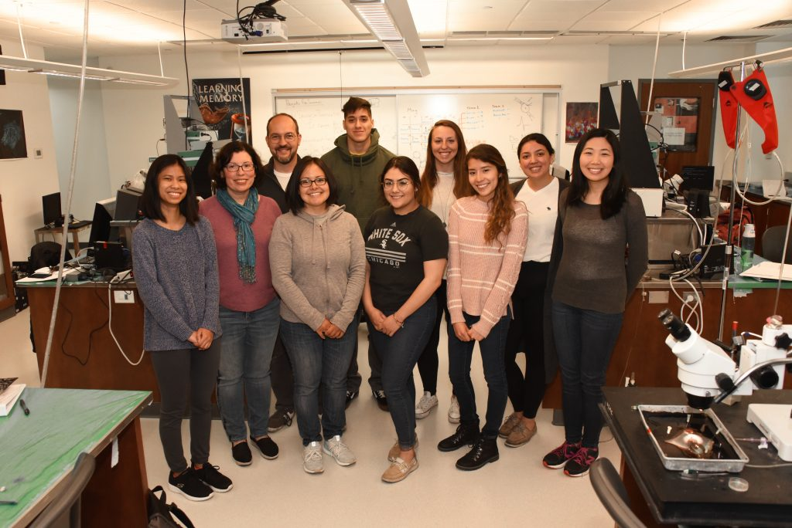
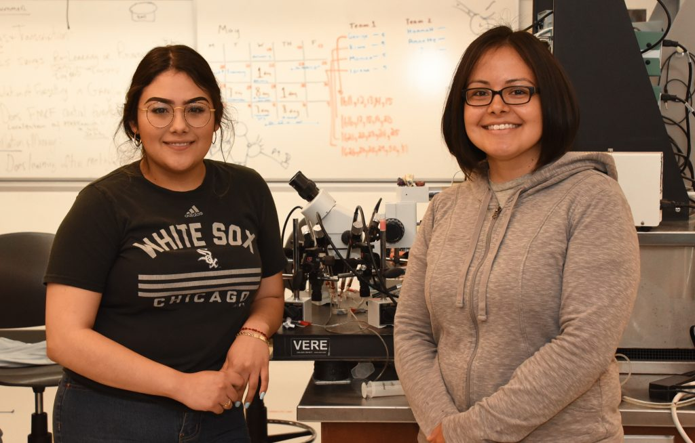

It’s summer and the slug lab is rocking. We have 8 students working in the lab (!), and a number of really exciting projects.

Here’s the lab photo to start the summer.

From left to right: Kiara Rana, Dr. C-J, Dr.Bob, Tania Rosiles, George Garcia, Annette Garcia, Hannah Gordon, Lorena Juarez, Monica Duron, and Melissa Nguyen

We knew this spring that we had recruited a special group of students in to the lab. So far the work this summer has confirmed our hunch–we’ve already completed two rounds of behavioral testing, students are making progress learning qPCR, and yesterday we had a great start to learning electrophysiology. I’m sure we’ll have our ups and downs, but it seems like we’re poised for a fun and productive summer.

Projects we’ll be working on include: 1) investigating if savings memories are re-formed or re-covered, 2) investigating the role of the peptide transmitter FMRF-amide in forgetting, 3) exploring the role of methylation in memory maintenance, and 4) some exciting pilot testing with a paradigm for sensitization in fruit fly larva, in collaboration with Scott Kreher in biology.

Our work this summer continues to be supported by the NIH (our current R15 expired at the end of May, but looks like it will be renewed starting July 1). Huzzah.

In addition, Dominican has received a generous donation from [Joe Moskal](https://www.mccormick.northwestern.edu/news/articles/2017/10/joseph-moskal-receives-top-biotechnology-innovator-award.html) to start the Moskal scholars program. Joe is a professor of biomedical engineering at Northwestern, [a biotech entrepreneur](https://www.mccormick.northwestern.edu/news/articles/2017/10/joseph-moskal-receives-top-biotechnology-innovator-award.html), a Dominican trustee, and an all-around amazing guy. He generously helped Irina and me develop pilot data for our first grant and provided a sparkling letter of support… so it is no exaggeration to say he has already helped make the slug lab what it is today.

This year, Joe took the next step in his efforts to develop and broaden the biotech pipeline by funding the Moskal scholars program. Over the next five years this program will fund students interested in careers in the life and health sciences to spend a summer engaged in intensive research. The goal is for students to have the space, mentoring, and encouragement to develop their skills and passions in the science, and to launch them forward to great things.

Our first two Moskal scholars are Annette Garcia and Tania Rosiles. Tania will be spending her second summer in the slug lab–she’s already gained tremendous lab skills and helped co-author our recent paper on the long-term transcriptional response to sensitization ​(Patel et al., 2018)​. Annette is new to the lab, but was a star in Dr. C-J’s neurobiology class and has already been making big strides in the lab.

The inaugural Moskal Scholars: Annette Garcia and Tania Rosiles

Neither Irina nor I would be where we are today if we hadn’t been fortunate enough to have amazing summer experiences. For Irina it was a summer working at Loyola Medical School. For me, it was a summer at Carnegie Mellon. In both cases it was generous funding from sponsors that enabled us to forgo our usual summer jobs and spend 3 months in intense and life-altering contemplation and study. We are so excited and proud to pay that forward each summer with a new batch of slug lab recruits, and we’re extremely grateful to Joe Moskal for his generosity and support.

One of our annual summer traditions is having DU photographer Ryan Pagelow come to the lab for a group photo and some science B-roll. As always, he does an amazing job. Here’s this year’s album:

1. Patel, U., Perez, L., Farrell, S., Steck, D., Jacob, A., Rosiles, T., … Calin-Jageman, I. E. (2018). Transcriptional changes before and after forgetting of a long-term sensitization memory in Aplysia californica. *Neurobiology of Learning and Memory*, 474–485. doi: [10.1016/j.nlm.2018.09.007](https://doi.org/10.1016/j.nlm.2018.09.007)