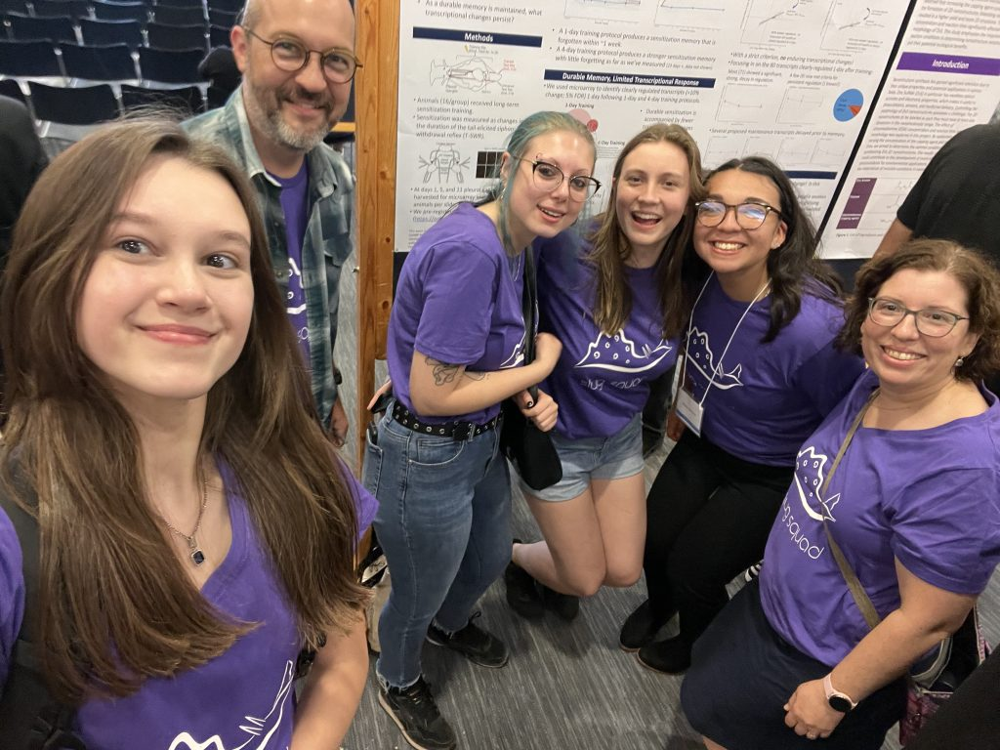
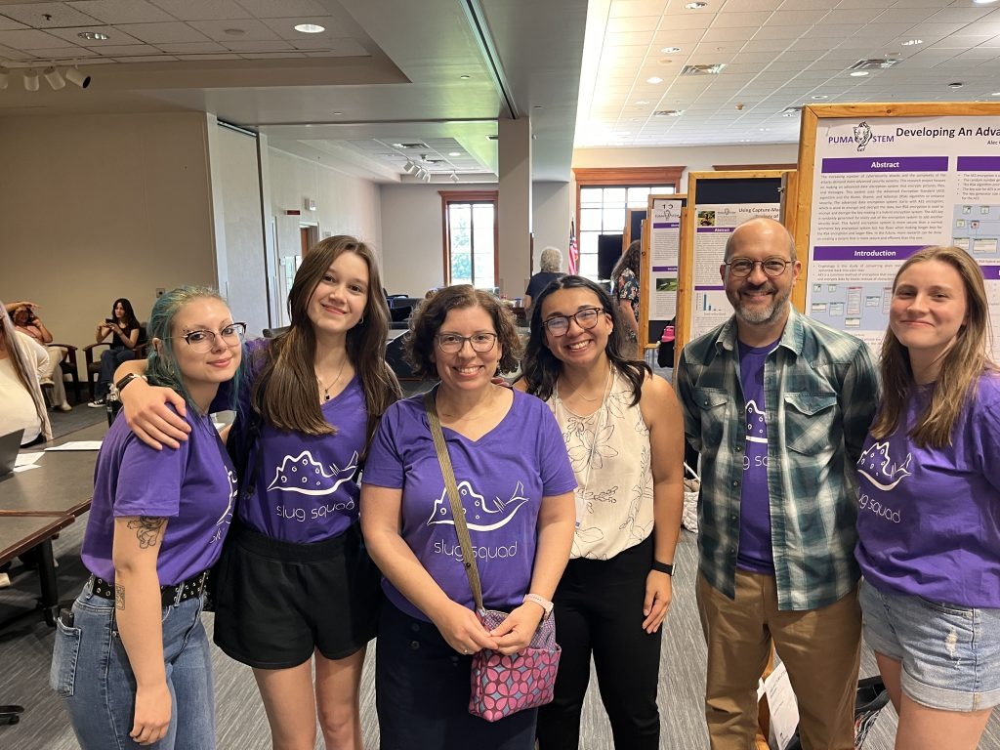
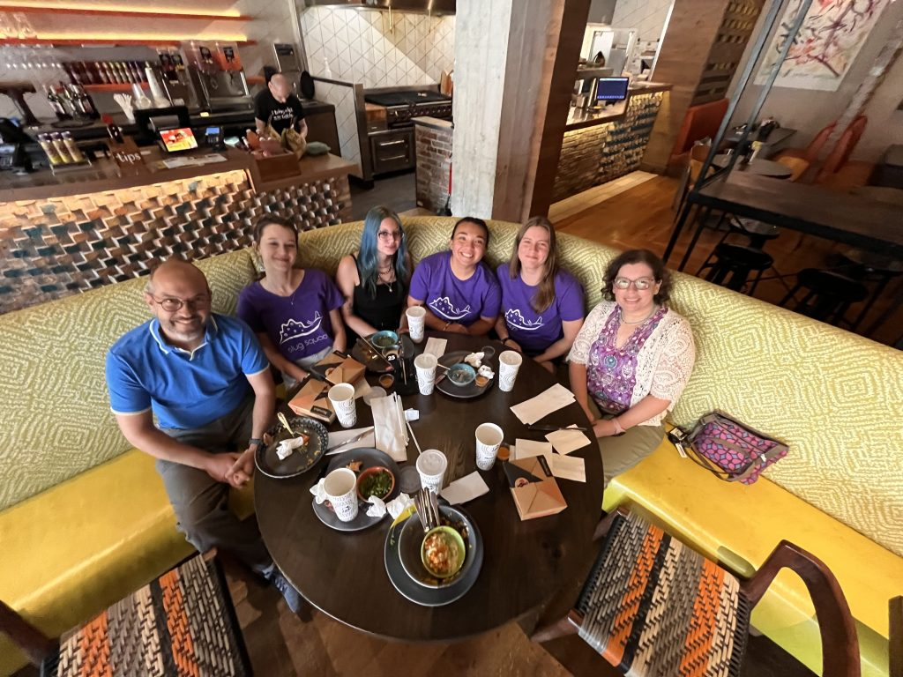
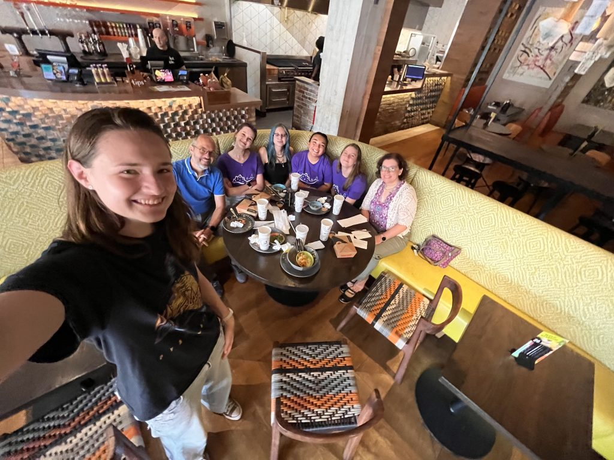
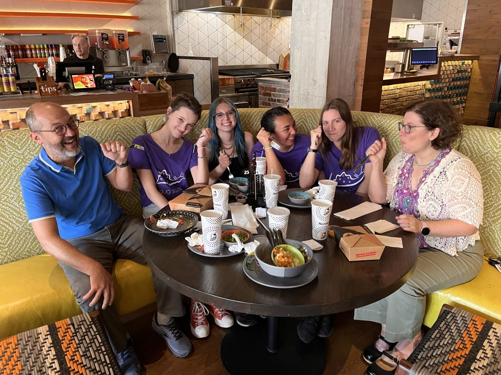

It’s hard to believe the summer research season has come and gone: 10 weeks of ups, downs, and lots of laughs. Overall, it’s been an incredibly productive summer — we made huge progress on our methylation project, perfected our cell-type isolation technique, and have warehoused a bunch of samples that will soon enable us to resolve how the transcriptional correlates of sensitization at the single-cell-type level. It’s been a \*lot\* of work — lots of training, dissection, RT, qPCR… endless tubes and work. But really exciting!

We capped off the last week by a) submitting abstracts for the Faculty for Undergraduate Neuroscience poster session at this year’s Society for Neuroscience meeting and b) having a great lab lunch at Nando’s. We also planned out even more work for the beginning of the fall semester. 🙂

Below or photos from the PUMA-STEM poster session (good job, Elise) and the lab lunch (notice the high fashion of the sluglab t-shirts).

