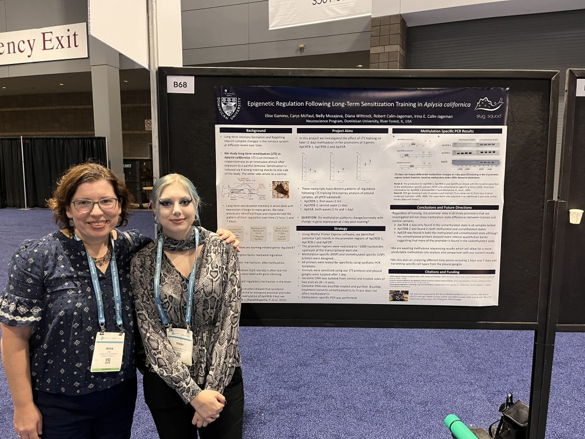
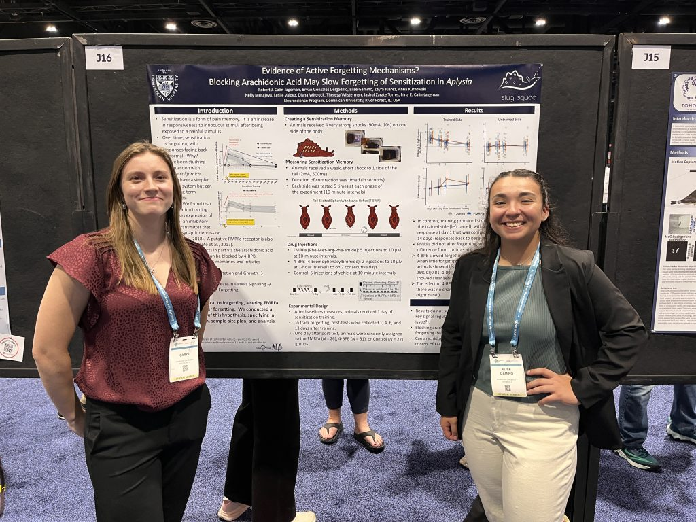
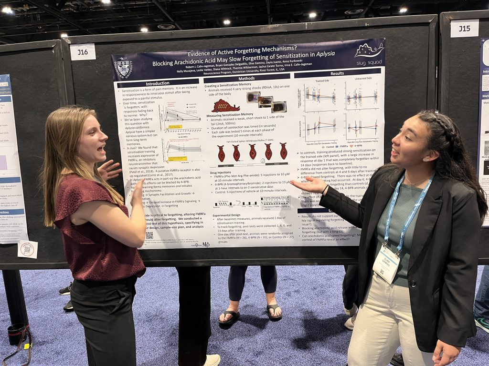
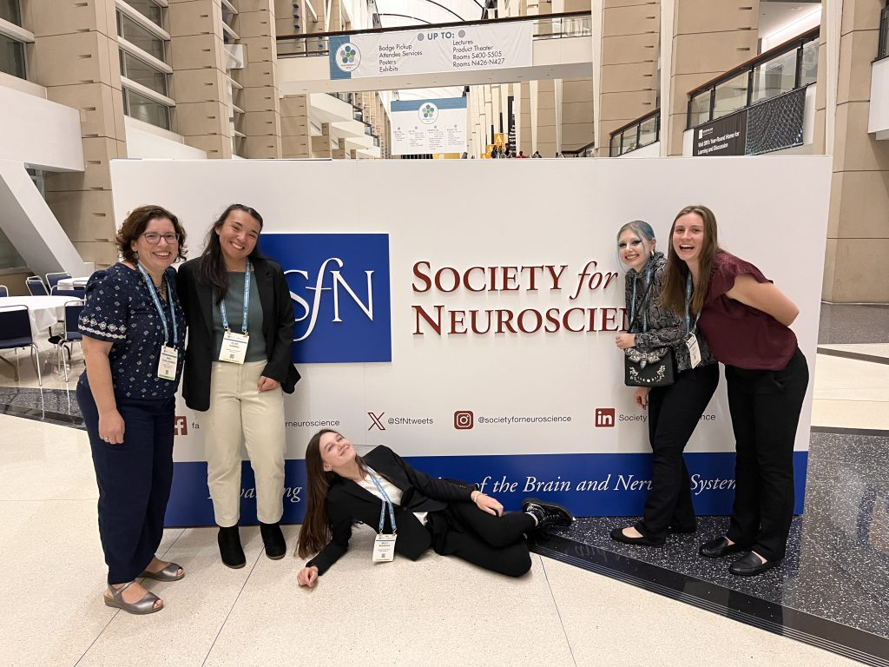
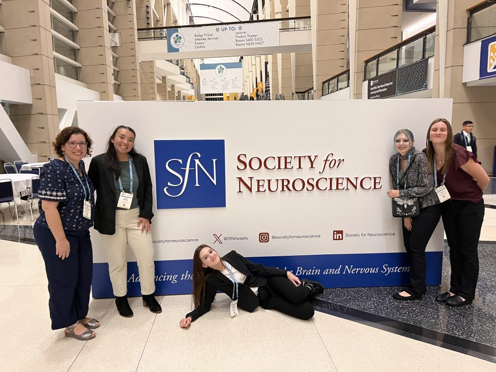
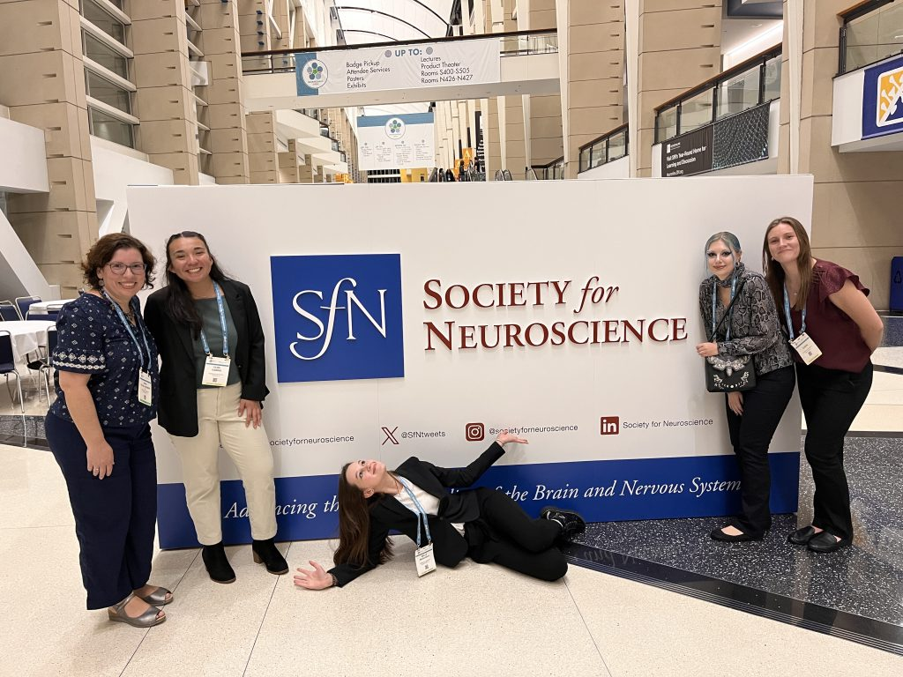
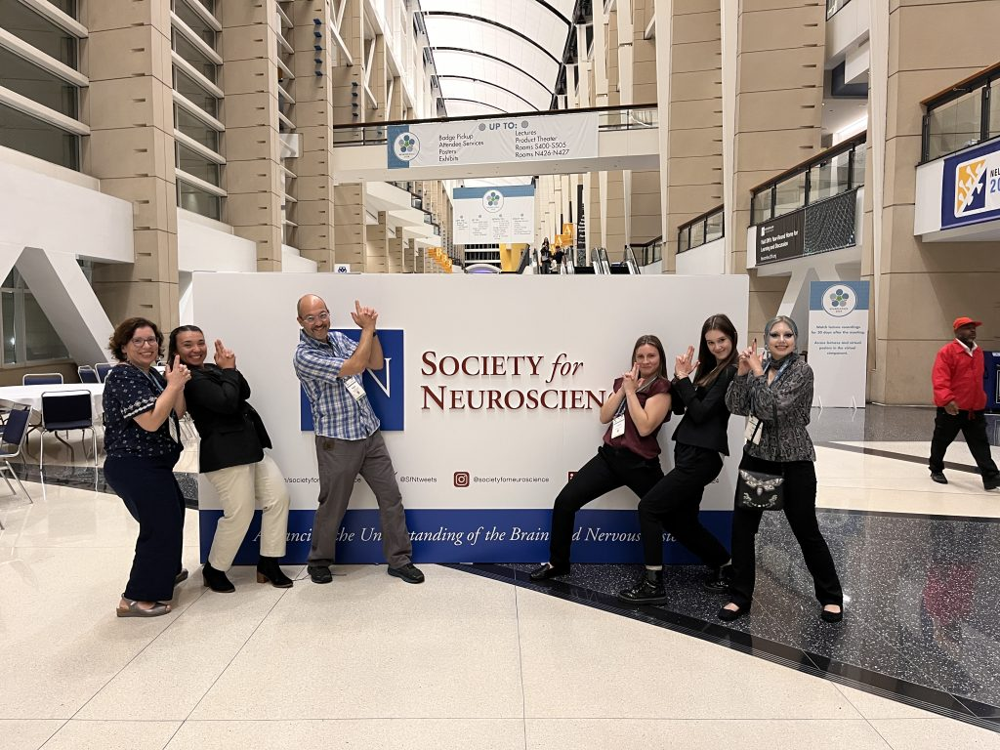
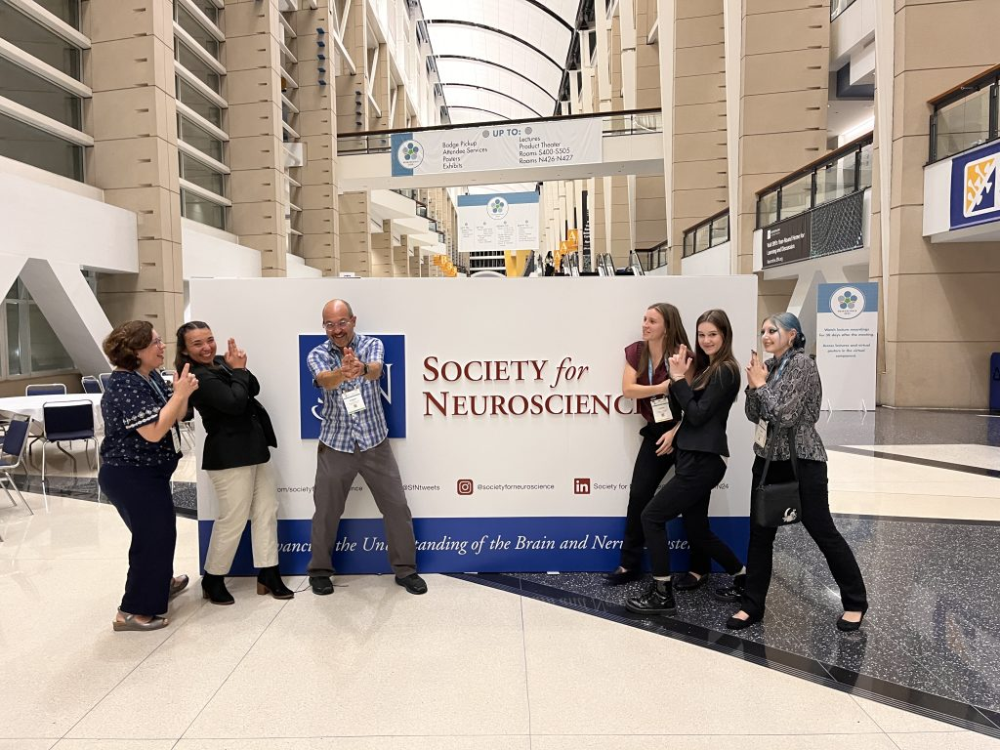
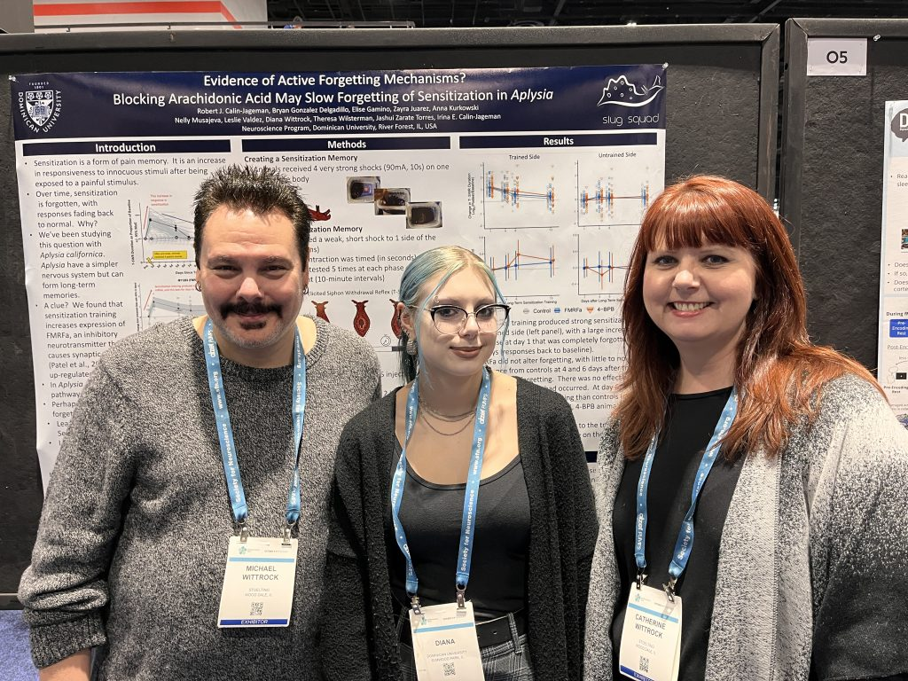
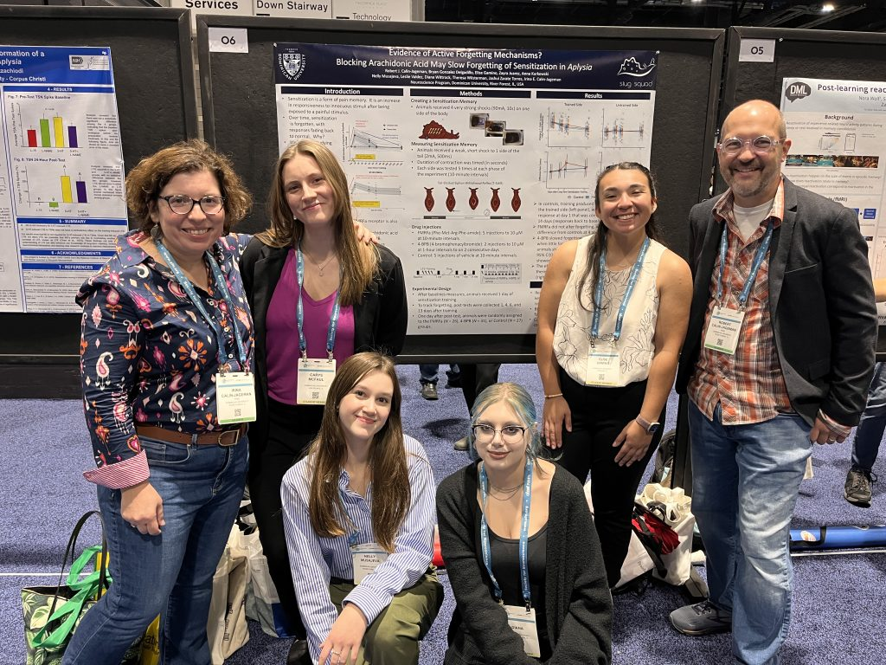

This year the Society for Neuroscience meeting came to the SlugLab’s backyard: Chicago!

We had a busy and really successful conference. SlugLab members Nelly Musajeva, Elise Gamino, Carys McFaul, and Diana Wittrock attended and got the chance to hear lots of neuroscience while also presenting the amazing work they’ve been doing in the lab.

With the SFN meeting being so big and sprawling, we had lots of chances to present:

* We presented two posters during the Molecular and Cellular Cognition pre-meeting, talking about the paper we published showing that arachidonic-acid signaling might regular forgetting  as well as new data on learning-induced changes in methylation (spoiler alert: so far we haven’t found any!).
* We then got to present the same two posters during the undergraduate poster session of SFN
* And then we got to present just the methylation poster during the main meeting, with a lovely Sunday-morning spot.

What was really lovely our students presenting to really different audiences: at MCCS it was memory specialists but not always folks who knew much about *Aplysia*, at the undergrad poster session it was a wide variety of neuroscientists (both in terms of expertise and experience level), and for the last presentation we were part of the “Invertebrate Learning and Memory” session, which meant it was specialists not only in learning and memory but often folks deeply familiar with *Aplysia* and the work we do (several times we presented to folks who were cited on the poster!). Shifting presentation styles to these different audiences was a great challenge, one that Nelly, Elise, Carys, and Diana did a great job with (it was especially exciting that they were repeatedly mistaken for graduate students!).

Another highlight of the meeting was that Dian’s parents got to attend and see her present on the main poster floor!

Congrats to the sluglab on another great SFN experience! Below is a photo gallery, including the lab having far too much fun in front of the main meeting sign.

1635500
{1635500:SLSJGANK}

1
apa
50
default

968
https://calin-jageman.net/lab/wp-content/plugins/zotpress/

%7B%22status%22%3A%22success%22%2C%22updateneeded%22%3Afalse%2C%22instance%22%3Afalse%2C%22meta%22%3A%7B%22request\_last%22%3A0%2C%22request\_next%22%3A0%2C%22used\_cache%22%3Atrue%7D%2C%22data%22%3A%5B%7B%22key%22%3A%22SLSJGANK%22%2C%22library%22%3A%7B%22id%22%3A1635500%7D%2C%22meta%22%3A%7B%22creatorSummary%22%3A%22Calin-Jageman%20et%20al.%22%2C%22parsedDate%22%3A%222024-04-01%22%2C%22numChildren%22%3A3%7D%2C%22bib%22%3A%22%26lt%3Bdiv%20class%3D%26quot%3Bcsl-bib-body%26quot%3B%20style%3D%26quot%3Bline-height%3A%202%3B%20padding-left%3A%201em%3B%20text-indent%3A-1em%3B%26quot%3B%26gt%3B%5Cn%20%20%26lt%3Bdiv%20class%3D%26quot%3Bcsl-entry%26quot%3B%26gt%3BCalin-Jageman%2C%20R.%20J.%2C%20Delgadillo%2C%20B.%20G.%2C%20Gamino%2C%20E.%2C%20Juarez%2C%20Z.%2C%20Kurkowski%2C%20A.%2C%20Musajeva%2C%20N.%2C%20Valdez%2C%20L.%2C%20Wittrock%2C%20D.%2C%20Wilsterman%2C%20T.%2C%20Torres%2C%20J.%20Z.%2C%20%26amp%3B%20Calin-Jageman%2C%20I.%20E.%20%282024%29.%20Evidence%20of%20Active-Forgetting%20Mechanisms%3F%20Blocking%20Arachidonic%20Acid%20Release%20May%20Slow%20Forgetting%20of%20Sensitization%20in%20Aplysia.%20%26lt%3Bi%26gt%3BeNeuro%26lt%3B%5C%2Fi%26gt%3B%2C%20%26lt%3Bi%26gt%3B11%26lt%3B%5C%2Fi%26gt%3B%284%29.%20%26lt%3Ba%20class%3D%26%23039%3Bzp-DOIURL%26%23039%3B%20href%3D%26%23039%3Bhttps%3A%5C%2F%5C%2Fdoi.org%5C%2F10.1523%5C%2FENEURO.0516-23.2024%26%23039%3B%26gt%3Bhttps%3A%5C%2F%5C%2Fdoi.org%5C%2F10.1523%5C%2FENEURO.0516-23.2024%26lt%3B%5C%2Fa%26gt%3B%26lt%3B%5C%2Fdiv%26gt%3B%5Cn%26lt%3B%5C%2Fdiv%26gt%3B%22%2C%22data%22%3A%7B%22itemType%22%3A%22journalArticle%22%2C%22title%22%3A%22Evidence%20of%20Active-Forgetting%20Mechanisms%3F%20Blocking%20Arachidonic%20Acid%20Release%20May%20Slow%20Forgetting%20of%20Sensitization%20in%20Aplysia%22%2C%22creators%22%3A%5B%7B%22creatorType%22%3A%22author%22%2C%22firstName%22%3A%22Robert%20J.%22%2C%22lastName%22%3A%22Calin-Jageman%22%7D%2C%7B%22creatorType%22%3A%22author%22%2C%22firstName%22%3A%22Bryan%20Gonzalez%22%2C%22lastName%22%3A%22Delgadillo%22%7D%2C%7B%22creatorType%22%3A%22author%22%2C%22firstName%22%3A%22Elise%22%2C%22lastName%22%3A%22Gamino%22%7D%2C%7B%22creatorType%22%3A%22author%22%2C%22firstName%22%3A%22Zayra%22%2C%22lastName%22%3A%22Juarez%22%7D%2C%7B%22creatorType%22%3A%22author%22%2C%22firstName%22%3A%22Anna%22%2C%22lastName%22%3A%22Kurkowski%22%7D%2C%7B%22creatorType%22%3A%22author%22%2C%22firstName%22%3A%22Nelly%22%2C%22lastName%22%3A%22Musajeva%22%7D%2C%7B%22creatorType%22%3A%22author%22%2C%22firstName%22%3A%22Leslie%22%2C%22lastName%22%3A%22Valdez%22%7D%2C%7B%22creatorType%22%3A%22author%22%2C%22firstName%22%3A%22Diana%22%2C%22lastName%22%3A%22Wittrock%22%7D%2C%7B%22creatorType%22%3A%22author%22%2C%22firstName%22%3A%22Theresa%22%2C%22lastName%22%3A%22Wilsterman%22%7D%2C%7B%22creatorType%22%3A%22author%22%2C%22firstName%22%3A%22Jashui%20Zarate%22%2C%22lastName%22%3A%22Torres%22%7D%2C%7B%22creatorType%22%3A%22author%22%2C%22firstName%22%3A%22Irina%20E.%22%2C%22lastName%22%3A%22Calin-Jageman%22%7D%5D%2C%22abstractNote%22%3A%22Long-term%20sensitization%20in%20Aplysia%20is%20accompanied%20by%20a%20persistent%20up-regulation%20of%20mRNA%20encoding%20the%20peptide%20neurotransmitter%20Phe-Met-Arg-Phe-amide%20%28FMRFa%29%2C%20a%20neuromodulator%20that%20opposes%20the%20expression%20of%20sensitization%20through%20activation%20of%20the%20arachidonic%20acid%20second-messenger%20pathway.%20We%20completed%20a%20preregistered%20test%20of%20the%20hypothesis%20that%20FMRFa%20plays%20a%20critical%20role%20in%20the%20forgetting%20of%20sensitization.%20Aplysia%20received%20long-term%20sensitization%20training%20and%20were%20then%20given%20whole-body%20injections%20of%20vehicle%20%28N%20%3D%2027%29%2C%20FMRFa%20%28N%20%3D%2026%29%2C%20or%204-bromophenacylbromide%20%284-BPB%3B%20N%20%3D%2031%29%2C%20a%20phospholipase%20inhibitor%20that%20prevents%20the%20release%20of%20arachidonic%20acid.%20FMRFa%20produced%20no%20changes%20in%20forgetting.%204-BPB%20decreased%20forgetting%20measured%206%20d%20after%20training%20%5Bds%20%3D%200.55%2095%25%20CI%280.01%2C%201.09%29%5D%2C%20though%20the%20estimated%20effect%20size%20is%20uncertain.%20Our%20results%20provide%20preliminary%20evidence%20that%20forgetting%20of%20sensitization%20may%20be%20a%20regulated%2C%20active%20process%20in%20Aplysia%2C%20but%20could%20also%20indicate%20a%20role%20for%20arachidonic%20acid%20in%20stabilizing%20the%20induction%20of%20sensitization.%22%2C%22date%22%3A%222024%5C%2F04%5C%2F01%22%2C%22section%22%3A%22%22%2C%22partNumber%22%3A%22%22%2C%22partTitle%22%3A%22%22%2C%22DOI%22%3A%2210.1523%5C%2FENEURO.0516-23.2024%22%2C%22citationKey%22%3A%22%22%2C%22url%22%3A%22https%3A%5C%2F%5C%2Fwww.eneuro.org%5C%2Fcontent%5C%2F11%5C%2F4%5C%2FENEURO.0516-23.2024%22%2C%22PMID%22%3A%2238538086%22%2C%22PMCID%22%3A%22%22%2C%22ISSN%22%3A%222373-2822%22%2C%22language%22%3A%22en%22%2C%22collections%22%3A%5B%22TKS5RDUA%22%5D%2C%22dateModified%22%3A%222024-05-15T21%3A17%3A13Z%22%7D%7D%5D%7D

Calin-Jageman, R. J., Delgadillo, B. G., Gamino, E., Juarez, Z., Kurkowski, A., Musajeva, N., Valdez, L., Wittrock, D., Wilsterman, T., Torres, J. Z., & Calin-Jageman, I. E. (2024). Evidence of Active-Forgetting Mechanisms? Blocking Arachidonic Acid Release May Slow Forgetting of Sensitization in Aplysia. *eNeuro*, *11*(4). <https://doi.org/10.1523/ENEURO.0516-23.2024>

