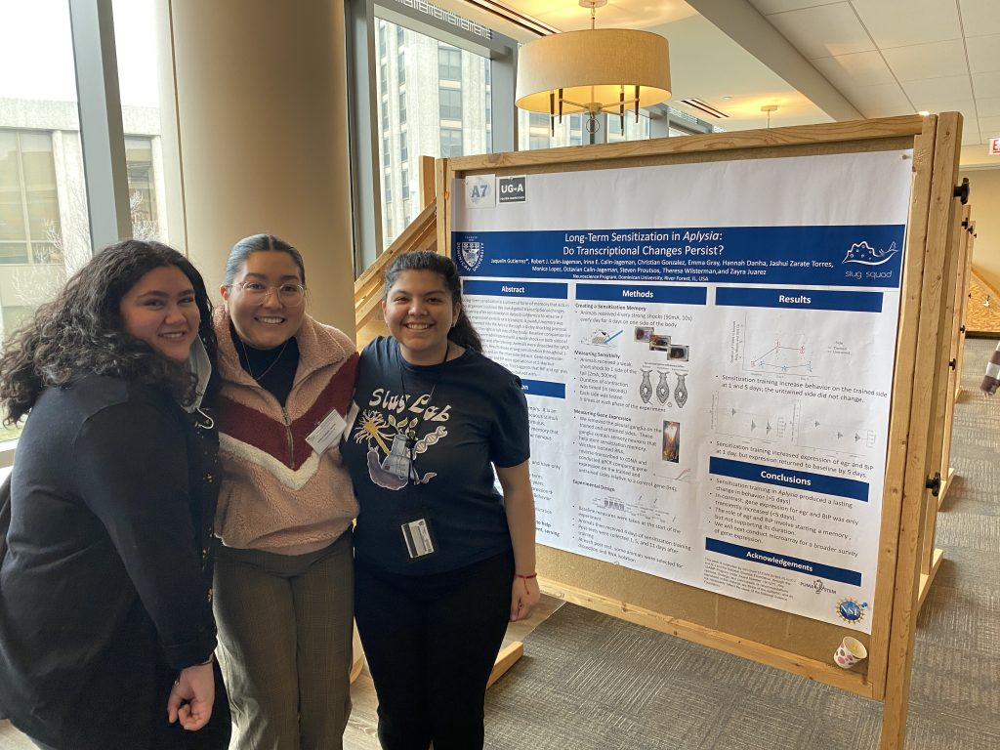
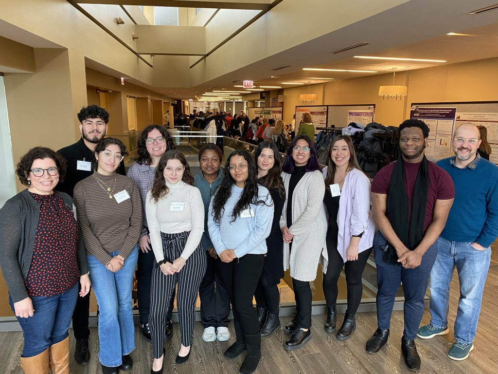
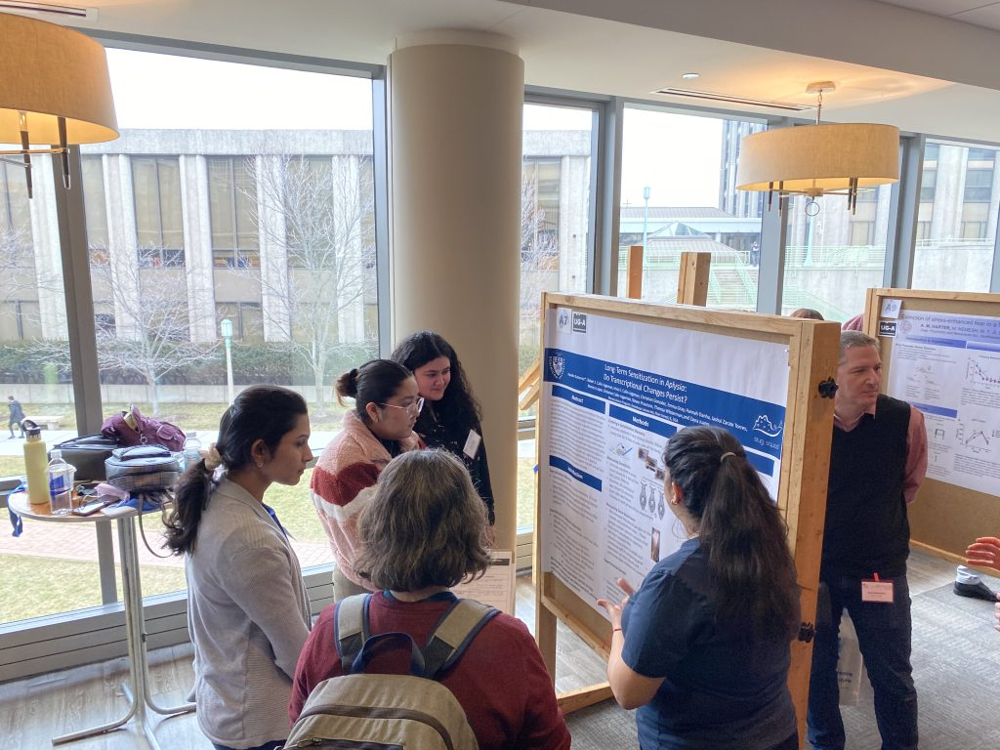
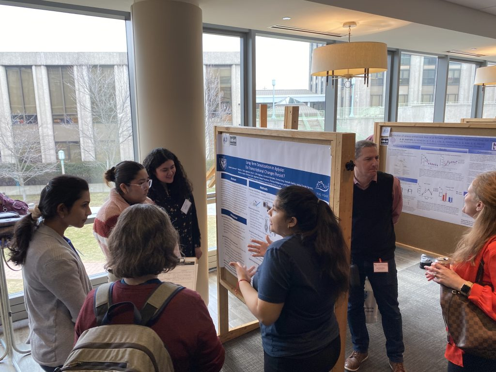
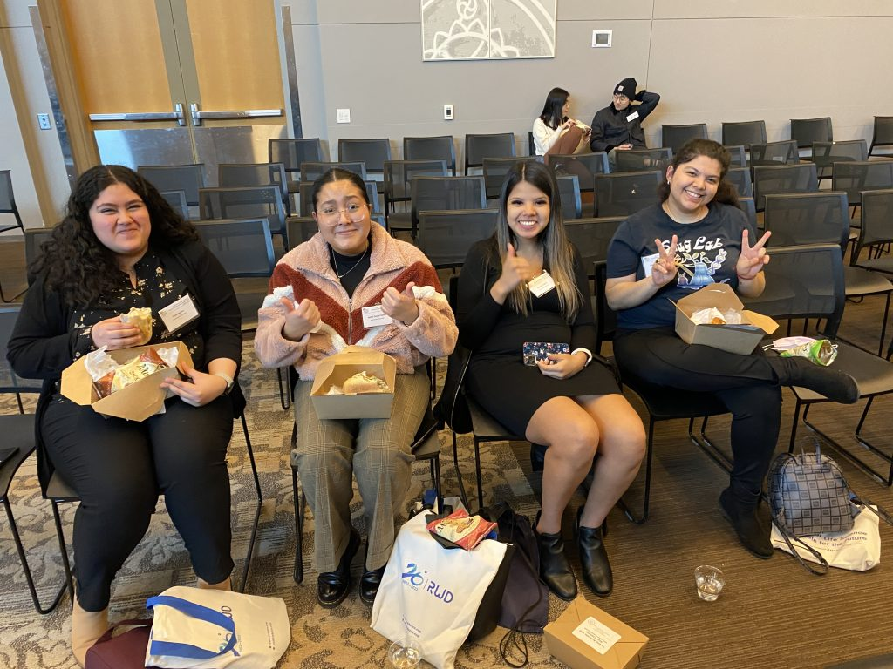

The SlugLab was in full force at the 2023 meeting of the Chicago Society or Neuroscience.

* Zayra, Jackie, and Jash presented a poster reporting the very-long-term sensitization project we worked on this past summer.
* Theresa snuck in some science before escaping for her softball team’s spring break trip.
* We got to catch up with Cristian, a SlugLab alum now working as a lab technician at Rush.
* And, nearly all of C-J’s neurobio class attended, soaking up some fantastic neuroscience.

A big highlight was the address by [Carl Hart](https://drcarlhart.com/): “Exaggerating Harmful Drug Effects on the Brain Is Killing Americans” — it was a heartfelt, heartbreaking, and fascinating talk. Bravo to cSFN for highlighting Dr. Hart’s work and perspective.

Here are some photos to enjoy!

