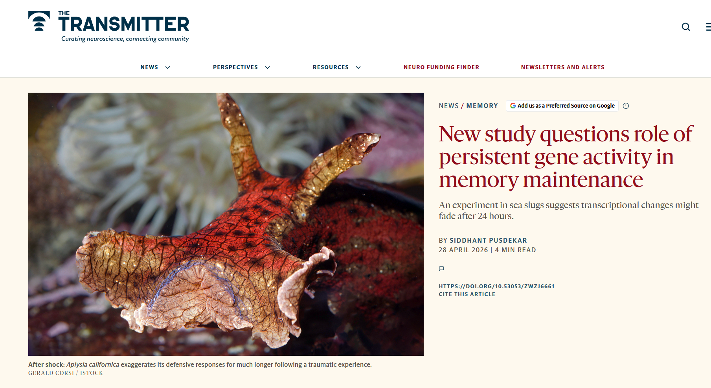

The most recent paper from the SlugLab was written up by *The Transmitter*:

<https://www.thetransmitter.org/memory/new-study-questions-role-of-persistent-gene-activity-in-memory-maintenance/>!

Really exciting to see this level of interest in our work! Big thanks to [Siddhant Pusdekar](https://www.thetransmitter.org/contributor/siddhant-pusdekar/) for the thoughtful interview and writeup.

The article is about our paper last month: [@rosiles2026]

{fig-alt="Masthead of The Transmitter for an article about the Sluglab" width="416"}
