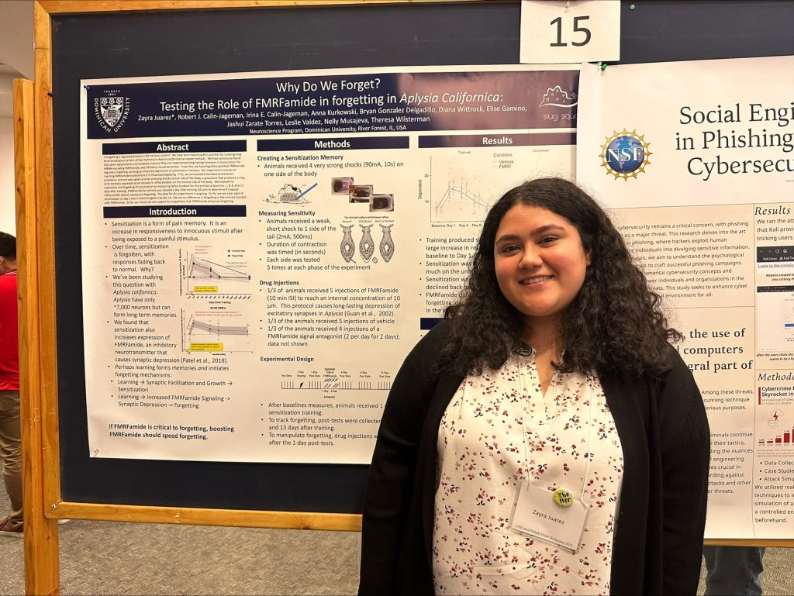
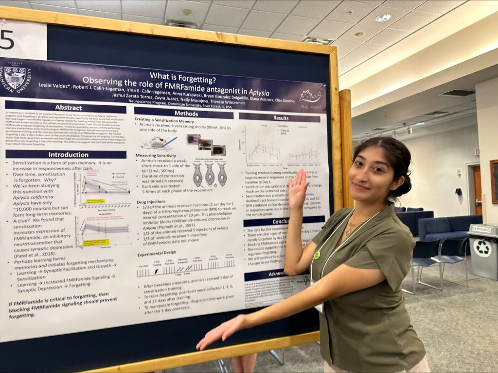
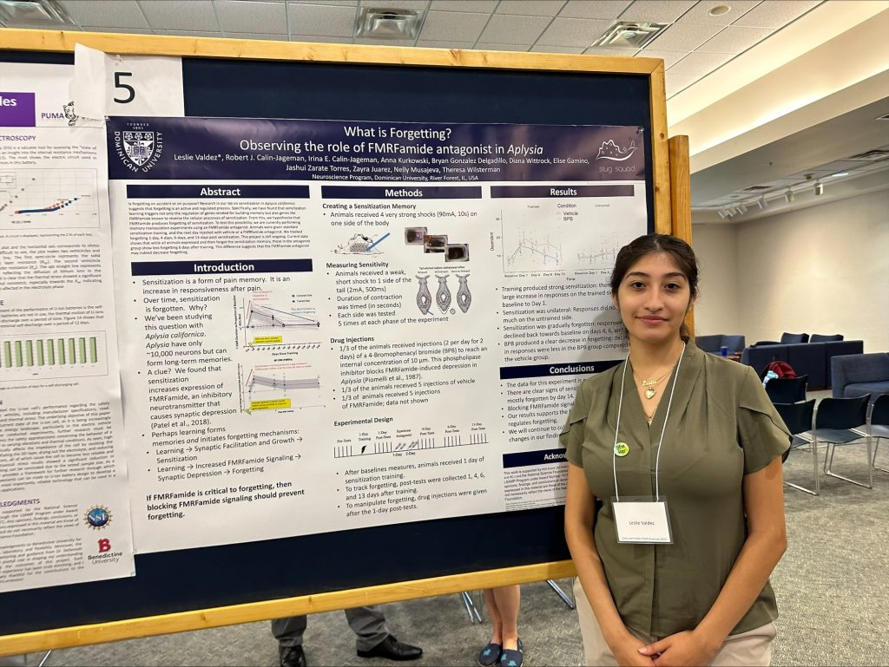
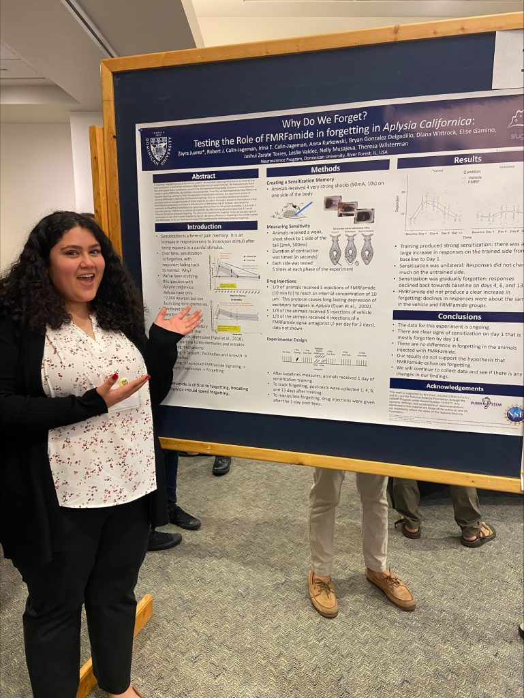
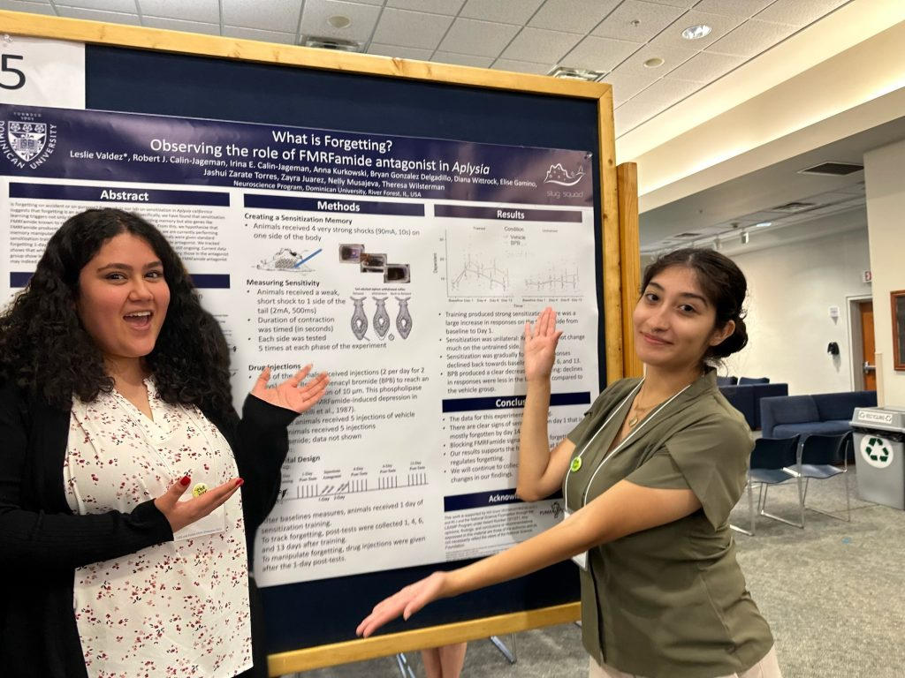

At the end of July, PUMA-STEM scholars Zayra Juarez and Leslie Valdez had the opportunity to attend the PUMA-STEM summer research conference and present their summer projets from the SlugLab. Despite a bit of initial anxiety, Leslie and Zayra **crushed** it. Oh, and Elmhurst turns out to have an ok-ish campus; nothing compared to ~~murder~~Thatcher woods, though.

Zayra telling the world about FMRFamide

Leslie manipulating memories

This one is a photoshop because they forgot to get a photo together.

Thanks to black-hat Hacker Jash ZT for the photoshop work — She manipulating memories about our memory manipulation work… very meta.