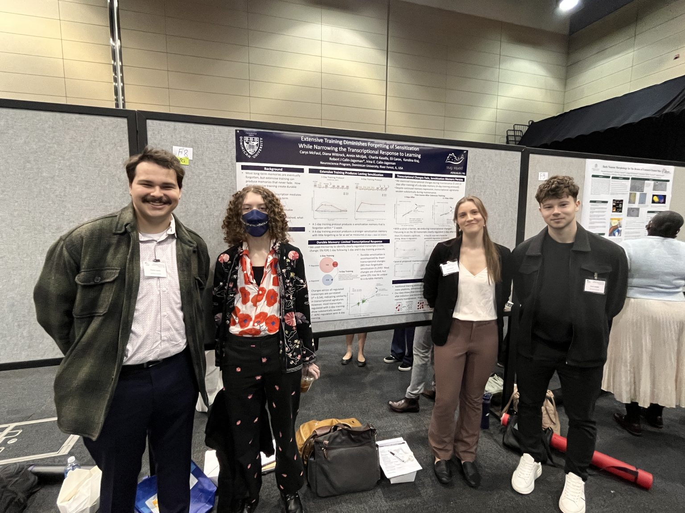

Last week the SlugLab carried on the annual tradition of attending the Chicago Society for Neuroscience meeting. It’s a wonderful regional meeting — great keynote speakers, fun poster sessions, and lots of great programming, especially for students. We actually bring the entire Dominican University Neurobiology class to this meeting, and it’s been a great way for students to get to engage directly with the neuroscience community in Chicago.

This year was especially notable: SlugLab member Carys McFaul won 1st place in the undergraduate poster presentation for the work she presented examining the molecular correlates of forgettable vs. unforgettable forms of sensitization memory. Congrats, Carys! It was a well-deserved honor, as the project is fascinating and Carys’ presentation skills are formidable.

For the project: Most memories (even long-term ones) fade, becoming progressively harder to recall. But with extended training memories can enter the “permastore”, becoming very resistant to forgetting. Why? What is physically different between a “forgettable” memory and the forgetting-resistant memories produced by enhanced training. To find we gave *Aplysia* standard sensitization training (1 day of training) and enhanced training (4 days of training). As expected, there was a huge training effect: with 1 day of training the memory was strongly expressed 1 day later but faded completely within 1 week; with the enhanced training the memory was strongly expressed for 11 days with almost no decrease in strength. We then used microarray to characterize gene expression 1, 5, and 11 days after enhanced training. We found two fascinating things: 1) enhanced training seems to produce *fewer* changes in gene expression than standard training and 2) almost all of the transcriptional chances produced by enhanced training fade quickly, with very little of the pattern of regulation evident 1 day after training still intact at 5 and 11 days after training. What and what? We’re still trying to think this through. The fact that more training produces *less* regulation is intriguing — maybe the longer training continues the more focused the transcriptional changes become, perhaps there are even transcriptional changes that get shut down that would otherwise have promoted forgetting. Maybe? And for the rapid decay, that is really surprising: are there offsetting changes that keep memory a 0-sum game, or is there no further need of transcriptional changes to maintain a memory… not sure!

What we \*are\* sure about is that Carys has done an outstanding job, both in the lab and beyond, and that we’re very proud and excited for her win.

We started bringing students to the cSFN conference in 2009. There have been 3 undergraduate poster awards each year, so that is 51 total awards in the 17 years we’ve been attending (maybe 3 less than that due to Covid?). In that time, DU students have won 5 awards: Mary Petrosko won 2nd place in 2009, Kristine Bonnick won 3rd in 2010, Tim Lazicki won 1st in 2010, Leticia Perez won 1st in 2018, and Carys is the first-place winner for 2026. That means Dominican students have won 10% of all the awards since we started attending. Not bad given that cSFN draws undegrads from University of Chicago, Northwestern, Loyola, UIC, DePaul, Lake Forest, Augustana, and more… we’re just a tiny, tiny fraction of all the neuroscience students in the region… but Dominican keeps crushing it at cSFN!
