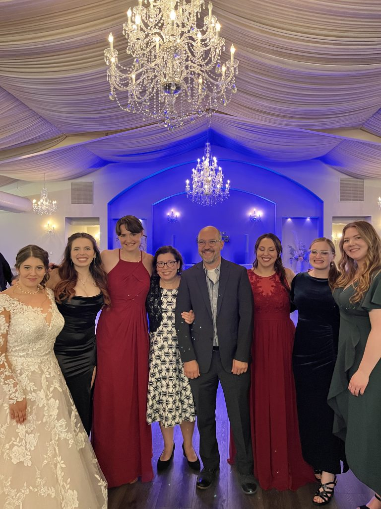

This past weekend was a milestone for the SlugLab — Irina and I attended the wedding of honorary Sluglab alum Catherine (Cat) Klostermann who tied the knot with Ryan Fagan (not a DU alum, but nevertheless a decent enough dude). In attendance were many DU and sluglab alumns, including Hannah Gordon who is now 4 years into her PhD studies at Notre Dame, Theresa Wilsterman who is working at Loyola Medical while applying to graduate school, Delaney McRiley who is working at a lab in Yale while applying to medical school, and Allyson Dilday, neuroscience major!

Congrats, Cat and Ryan — we wish you many happy years of a love and friendship.

