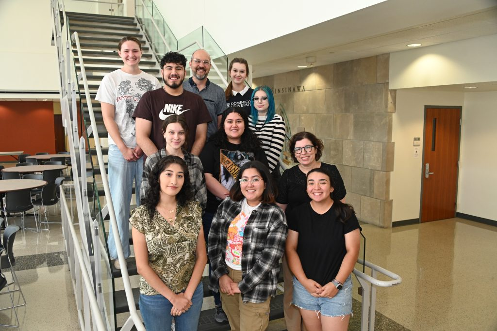

It’s summer, and that means it is once again time for the sluglab to roar into action. As usual, we have a great set of junior scientists, a new batch of burning research questions, and a drive to have as much fun as possible along the way.

This summer (2023), the lab will be working on a couple of different projects:

* **Timecourse of transcriptional changes with a very long-lasting memory.** We’ll be wrapping up our study of the transcriptional changes accompanying a very long-lasting form of memory. We’ve previously found that the transcriptional changes induced by learning fade quite quickly, with most (but not all) transcripts back to normal expression within 5 days​1,2​. This is perhaps because the form of memory we study is forgotten within about 7 days, but it made us wonder what happens with a long-lasting memory: Do transcriptional changes persist for the whole memory, and if so which ones? Or, is transcription primarily about inducing a memory and not maintaining it? To find out, we switched to a very intense long-term memory protocol (4 days of training) and have been tracking behavior and transcription 1 day, 5 days, and 11 days after training. We were nearly finished with this project in summer of 2022 but will spend some time this summer finishing primary data collection and conducting more qPCR.
* **Is forgetting an active process**? We recently found a paradoxical effect of sensitization training: It produces a long-lasting increase in expression of FMRFamide and its receptors​3,4​. This is strange because FMRFamide is an *inhibitory* peptide transmitter, and repeated exposure to FMRFamide *weakens* the synapses that help encode sensitization​5​. This led us to hypothesize that this increase in FMRFamide represents an active forgetting process: that sensitization specifically up-regulates signalling that will end up eroding the behavioral expression of the memory. That’s an exciting idea… but is it correct? To find out, we are tracking forgetting of sensitization while pharmacologically manipulating FMRFamide signaling, either injecting FMRFamide directly or a drug that blocks its activity. We’re really excited to see what this produces?
* **Experience-dependent transcription in *Lumbricus terrestris*.**  Our lab has long dreamed about conducting comparative analysis of the mechanisms of memory: Do different animals store sensitization memories in the same ways? This summer we’ll take a step towards being able to answer that question by exploring for experience-dependent changes in gene expression in the nightcrawler, *Lumbricus terrestris*. Why this organism? It’s really cheap, and it shows several basic forms of long-term memory​6​. This summer we’ll create a neuronal transcriptome of *Lumbricus* and we’ll explore changes in gene expression with injury and shock.
* **Aplysia sequencing project** — more about this later.

And now, let’s introduce the amazing crew of junior scientists who will be conducting this research:

* **Elise Gamino** – My name is Elise Gamino and I am a rising sophomore majoring in biology. I am also a softball player here at Dominican. I have been playing since I was 10 years old. This is my first summer in the slug lab and I have really enjoyed working here. I have learned so much and have also found a love for neuroscience. I am really excited to learn new things, especially learning about molecular biology and running through new protocols.
* **Zayra Juarez**
  + **Expected class of 2025**
  + **Neurobiology Major**
  + **Career goal:**Doctor of Medicine
  + **Why the slug lab?** Coming back to the lab for my second summer was something I was looking forward to. After having such an amazing last summer, I was excited to come back with all the skills I had learned and use them to help new members succeed. There have been some ups and downs like any research but that’s what makes the lab so exciting. We are able to bring questions and concerns and have them answered without judgment.
  + **What’s been an interesting or exciting part of being part of the lab this summer?**The most exciting part of this summer has been adding a new component to our regular experiment! Instead of only focusing on long-term sensitization of the slugs we now decided to introduce drugs that will be injected that either enhance or block forgetting.
* **Anna Kurkowski**
  + Hello, my name is Anna Kurkowski and I am a rising senior this year. I am majoring in biology with a minor in chemistry. I was enrolled and completed Dr. Irina Calin-Jageman’s neurobiology honors course where I saw my first sea slug. We had an opportunity to train and dissect the sea slug and perform RNA isolation, RT and PCR. Being able to work with these amazing creatures from start to finish was inspiring and intrigued me to continue working with them. I decided to apply for the summer research program in order to further my knowledge about how their memory and forgetting operates. In the lab I have had the opportunity to pre and post test the animals response to a small stimulus as well as training the animals to learn what a painful experience is. The training involves 4 rounds of shocks administered on and off for 10 seconds on the side they have been assigned to. These shocks are administered every 15 minutes and involve only one day of training. Once these animals have been taught what a painful memory is, they are then post tested to observe their behavior. I am also involved in providing the slugs with their drug injections. We have been injecting them with BPB as well a FMRFamide. By injecting them with a drug that we hope will enhance their ability to retain a memory for longer and a drug that we hope will decrease the ability to retain the memory for a longer period of time, we hope to be able to infer the effects of these drugs on the retention of memories. Being able to train and help with injections has been the highlight of the summer and I have learned an immense amount about how learning may work.
* **Nelly Musajeva**
  + Hi everyone! My name is Nelly and I’m an incoming sophomore, majoring in neurobiology and biochemistry. To have this amazing opportunity to work in the Sluglab and actively explore the behavioral and molecular parts of forgetting in Aplysia Californica has been special to me, as I’ve always been fascinated by the aspect of forgetting, especially when it comes to forgetting the most shocking experiences, memories of which seem so substantial and so vivid in our minds… Despite being anxious about entering the lab after just completing my first year at Dominican, and having limited lab experience, being part of the Sluglab this summer has been both a pleasurable and a stimulating experience that has taught me many technical lab skills, and has boosted my confidence in doing research in the future. I have been the most excited about doing behavioral testing with the sea slugs, measuring their gill-withdrawal response to the pain-inducing stimuli, especially because I have never interacted with live animals in the research setting before. I’ve also really enjoyed dissecting both Aplysia California and Lumbricus Terrestris, and going through the RNA isolation protocol. I recently realized how thrilling and intriguing it has been to approach the last step of different protocols, and to finally be able to see the outcomes of our work. This excitement applies to both small scale results, such as seeing the high RNA concentration on the nanodrop machine, and the anticipation of the results of our bigger project of whether it is possible to block or enhance the forgetting in Aplysia by injecting it with BPB or FMRFamide. It has also been fun to work with other intellectually curious sluggies in our team, and learning about the importance of working as a team, and checking all our work (and even double and triple checking!!). In addition to being involved in the Sluglab, I enjoy reading, observing people’s behavior (of course), learning languages, meditating, running and listening to science podcasts.
* **Leslie Valdez**
  + Hi everyone! My name is Leslie Valdez and I’m a current senior majoring in Neurobiology while minoring in Chemistry and Psychology. I’m involved on campus by participating in clubs like SustainDU and being the President of the Pre-Physician Assistant Association. During my free time, I love to read and travel to new food places. What I’m most excited about at the Slug Lab this summer is learning molecular lab skills and being able to present our work at Elmhurst and URSCI. This summer, my role in the lab is to record the duration of the slug’s reflexes, and I’m on my way to becoming a slug whisperer!
* **Theresa Wilsterman**
  + Hello, my name is Theresa Wilsterman, and this is my second year in the Slug Lab. As I am entering my senior year at Dominican, I will be finishing up my requirements to graduate with majors in biochemistry and behavioral neuroscience and a minor in physics. Although I am excited to finally accomplish my academic goals I have set at Dominican, I am sad to think about leaving the slug lab. There are so many things I love about working in the slug lab but one of my favorite things to do is run reverse-transcription in Dr. CJ’s mini lab. I find a lot of satisfaction playing music through the computer speakers and flowing through a protocol with my partner.
  + This year, however, I have developed a passion for working with others and training new members of the slug lab. Since everyone was new to the slug lab last year, we had to learn how to do everything at the same time. Lots of lessons were learned through mistakes, but ultimately helped me instruct others this year. Pre-labeling tubes or double-checking the settings on the shock box are examples of small details that I have emphasized to new sluggers. It’s exciting to see the newer generation of sluggers improve their behavioral and molecular technique! I can’t wait to come back in a few years and see how great the slug lab is doing and what they are up to.
* **Diana Wittrock**
  + Hi! My name is Diana and I plan to major in biology and minor in health communications.  Back before I was even enrolled here at Dominican, I remember attending an orientation for students interested in attending the university my senior year of high-school where Dr. Bob presented some of the basics of the slug research as a way to encourage potential students to get involved in undergraduate research. I immediately knew that was something I wanted to pursue in the future. Towards the end of my first year at Dominican, I sent in my application to join the Slug Lab research team, and was miraculously accepted! Although I felt extremely anxious to begin since I was only an incoming Sophomore and had limited lab experience, I was able to connect with like-minded people who mentored me through some of the more complicated protocols. I feel as though I’ve grown as not only a person, but an intellectual thinker, and I’m so fortunate to be involved with such meaningful work. This summer, I’ve been specializing in what we call “slug training,” which involves giving the animals we work with a painful memory by shocking them. I then administer injections of both FMRFamide and BPB in hopes that each drug can manipulate memory through gene activation or repression.
* **Jash Zarate Torres**
  + Hello! My name is Jashui, but I go by Jash (pronounced like the avocado). I am a rising Junior at DU, majoring in Neurobiology with minors in Sociology and Chemistry in the pre-medicine track. Additionally, I am this year’s Moskal Scholar in the lab- shout out to Dr. Moskal for funding my research experience as a returning member to the Slug Lab from the Summer 2022 cohort!
  + Although I find joy in performing both behavioral and molecular aspects of our research, I have dedicated the majority of my time this summer to pre and post testing slugs. This means that I measure their reaction time by paying close attention to their body’s contraction and relaxation to see how implementing a painful memory changes their behavior. This has been one of the most challenging yet rewarding tasks in the lab to perfect because everyone develops their own habits. However, after many animals and many, many, many more trials, I have slowly but surely become one of the lab’s Slug Whisperers! This summer, I have also found joy in implementing my leadership skills from being a tutor at DU by assisting our new participants in learning our multidisciplinary protocols and overall sharing advice that has helped me succeed in this intellectual setting.
  + Being able to participate in this lab means a lot to me, as it has opened the doors for me regardless of my undocumented status, to further explore my identity as a scientist by learning the inquisitive process of experiments, collaborating with others, and thinking creatively around problems.
  + In my free time, you will most likely find me fighting over social justice movements, enjoying a romance novel (as a respective Cancerian), eating out with my loved ones while I capture the moment with my polaroid, and drinking lots of coffee!

1. 1.

   Rosiles T, Nguyen M, Duron M, et al. Registered Report: Transcriptional Analysis of Savings Memory Suggests Forgetting is Due to Retrieval Failure. *eNeuro*. Published online September 14, 2020:ENEURO.0313-19.2020. doi:[10.1523/eneuro.0313-19.2020](https://doi.org/10.1523/eneuro.0313-19.2020)
2. 2.

   Perez L, Patel U, Rivota M, Calin-Jageman IE, Calin-Jageman RJ. Savings memory is accompanied by transcriptional changes that persist beyond the decay of recall. *Learn Mem*. Published online December 15, 2017:45-48. doi:[10.1101/lm.046250.117](https://doi.org/10.1101/lm.046250.117)
3. 3.

   Patel U, Perez L, Farrell S, et al. Transcriptional changes before and after forgetting of a long-term sensitization memory in Aplysia californica. *Neurobiology of Learning and Memory*. Published online November 2018:474-485. doi:[10.1016/j.nlm.2018.09.007](https://doi.org/10.1016/j.nlm.2018.09.007)
4. 4.

   Conte C, Herdegen S, Kamal S, et al. Transcriptional correlates of memory maintenance following long-term sensitization of *Aplysia californica*. *Learn Mem*. Published online September 15, 2017:502-515. doi:[10.1101/lm.045450.117](https://doi.org/10.1101/lm.045450.117)
5. 5.

   Guan Z, Giustetto M, Lomvardas S, et al. Integration of Long-Term-Memory-Related Synaptic Plasticity Involves Bidirectional Regulation of Gene Expression and Chromatin Structure. *Cell*. Published online November 2002:483-493. doi:[10.1016/s0092-8674(02)01074-7](https://doi.org/10.1016/s0092-8674(02)01074-7)
6. 6.

   Watanabe H, Takaya T, Shimoi T, Ogawa H, Kitamura Y, Oka K. Influence of mRNA and protein synthesis inhibitors on the long-term memory acquisition of classically conditioned earthworms. *Neurobiology of Learning and Memory*. Published online March 2005:151-157. doi:[10.1016/j.nlm.2004.11.003](https://doi.org/10.1016/j.nlm.2004.11.003)