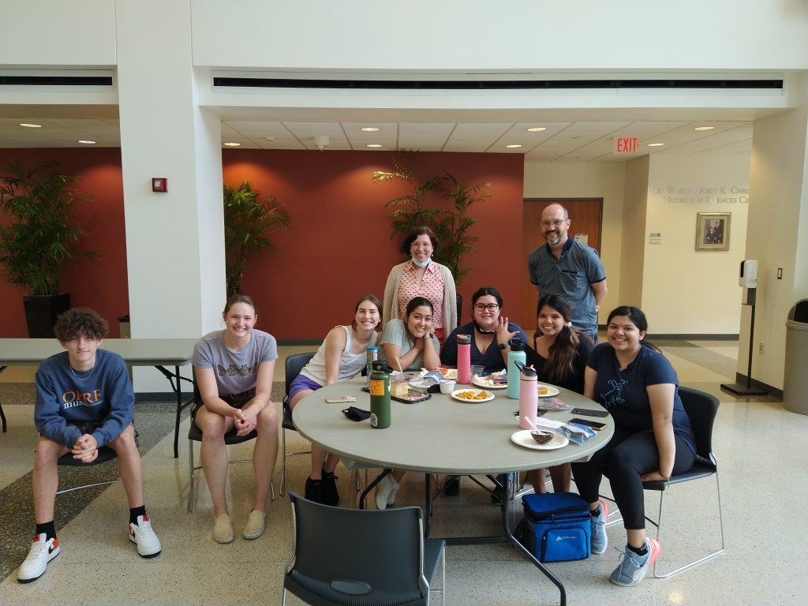
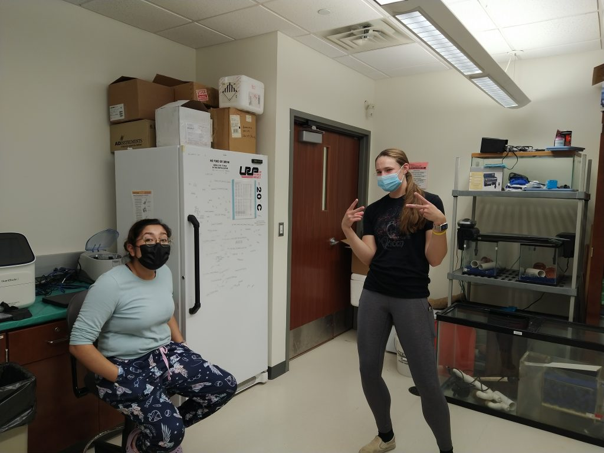
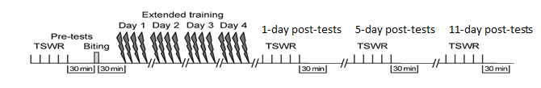

It’s July of 2022 and for the past 2 months the SlugLab has been lurching back into life.

For the first time since 2019, the sluglab welcomed a new cohort of summer research students: a record 10 students!

Start of the summer celebration with Tavi, Theresa, Emma, Jas, Zayra, Monica, and Jaquelin (all seated); Christian, Steven, and Hannah.

We’ve so far been confronting the many problems associated with getting the lab back up and running. All previous SlugLab students had graduated, so training had to start from scratch with everything: tank maintenance, siphon-withdrawal reflex measurement, sensitization training, dissections, RNA isolation, qPCR, and data analysis.

Not only has getting everyone up to speed been a challenge, there have also been many challenges to confront from raising up the lab from dormancy. We had challenges with our RNA isolation protocol, an unhealthy batch of animals, a tank that shut down mysteriously over the weekend (and a tank monitoring system that didn’t sound the alarm!), a new file sharing service imposed by the university (which has been terrible), a simulator set up wrong… it’s really been an uphill fight almost every step of the way.

While the list of challenges has been lengthy, it’s turned out to be a lot of fun overcoming them. Our new and large group of sluglab scientists has brought tremendous enthusiasm and camaraderie, a surprisingly deep level of artistic talent, donuts, and a whole lot of fun to the lab. We’ve been knocked down, but we’ve made funny memes about it, and got back up again.

Nothing but great concentrations in the SlugLab!

Maybe we’re also smiling because as we finally seem to have kick started the engine in the lab. We switched to hand homogenization and RNA yields have been amazing. We fixed the stimulator, got healthy animals, and doubled-down on training how to measure behavior, and viola–behavioral data has been pretty fantastic. With data starting to roll in we were finally able to have a lab meeting to work through how to analyze qPCR data, and students have been adding plate after plate of new data for us all to ponder.

At this point, it’s late July and things are really cooking! We have developed and pre-registered (https://osf.io/wvx6z/) an experiment to examine the transcriptional correlates of a very long lasting memory, and it looks like we might end the summer with all behavioral data and tissue collection complete (or at least close to it!). This is an exciting experiment. It’s very clear that forming new long-term memories changes gene expression. What is less clear, though, is if these transcriptional changes are needed to help create the memory, or if they are needed both to create and *maintain* the memory. Neuroscientists have generally assumed an important role in maintenance, and some models specifically imagine transcriptional feed-back loops that help perpetuate transcription to help maintain memory expression​1​. But this would be a costly way to store a memory. Maybe instead, memories can become transcriptionally independent–perhaps by re-allocating resources within a neuron rather than permanently increasing them.

Our lab has had some hints that transcription might not persist throughout maintenance, at least not for the form of long-term sensitization we study in *Aplysia*. First, we’ve found that transcriptional changes after sensitization fade within 5 days, 2 days earlier than the memory lasts​2​. This might mean that transcription isn’t needed for maintenance, but it could also mean that there is a slight lag between gene expression decaying and memory expression decaying (2 days isn’t that much of a gap). A second line of evidence is that we’ve found that re-activating a seemingly forgotten memory requires no new changes in gene expression (at least none we could detect), suggesting an uncoupling between memory expression and transcription​3​. This is all suggesting, but not at all definitive.

Now we are collecting data that might help illuminate what role (if any) transcription plays in maintaining a long-term sensitization memory. To do this, we’ve cranked up our training protocol to 11– we are training each animal for 4 consecutive days rather than 1. Work in the Byrne lab​4​ and other labs has suggested that this extended training protocol produces very long-lasting sensitization, and indeed we’re seeing robust behavioral expression 11 days after training (in our typical 1-day training protocol, behavior was almost always back to normal within 7 days). With this longer-lasting training protocol we can examine if transcription also lasts a long time (more than 5 days) or it it still fades quickly. Specifically, we’ll conduct microarray on samples harvested 1 and 5 days after the end of training, and compare the levels of gene regulation at those two time points. If we see that the widespread transcritptional changes at 1 day are still present at day 5, this would suggest a potential role in memory maintenance. However, if we see a decay in transcription at day 5, it would suggest something else is going on…. perhaps transcriptional changes are offset by compensatory mechanisms? Or perhaps memories can be maintained without an ongoing transcriptional change?

At this point we have no idea how the new study will work out… will transcription persist as long as behavior? Will it fade early? We don’t know, but we’re excited to find out. At this point, it looks like we might end the summer with all behavioral data collected and tissue harvested… so it won’t be too much longer now before we have an answer (hopefully).

It’s been a grueling but fantastic summer.

1. 1.

   Zhang Y, Smolen P, Baxter DA, Byrne JH. The sensitivity of memory consolidation and reconsolidation to inhibitors of protein synthesis and kinases: Computational analysis. *Learn Mem*. Published online August 24, 2010:428-439. doi:[10.1101/lm.1844010](https://doi.org/10.1101/lm.1844010)
2. 2.

   Patel U, Perez L, Farrell S, et al. Transcriptional changes before and after forgetting of a long-term sensitization memory in Aplysia californica. *Neurobiology of Learning and Memory*. Published online November 2018:474-485. doi:[10.1016/j.nlm.2018.09.007](https://doi.org/10.1016/j.nlm.2018.09.007)
3. 3.

   Rosiles T, Nguyen M, Duron M, et al. Registered Report: Transcriptional Analysis of Savings Memory Suggests Forgetting is Due to Retrieval Failure. *eNeuro*. Published online September 14, 2020:ENEURO.0313-19.2020. doi:[10.1523/eneuro.0313-19.2020](https://doi.org/10.1523/eneuro.0313-19.2020)
4. 4.

   Wainwright ML, Byrne JH, Cleary LJ. Dissociation of Morphological and Physiological Changes Associated With Long-Term Memory in *Aplysia*. *Journal of Neurophysiology*. Published online October 2004:2628-2632. doi:[10.1152/jn.00335.2004](https://doi.org/10.1152/jn.00335.2004)