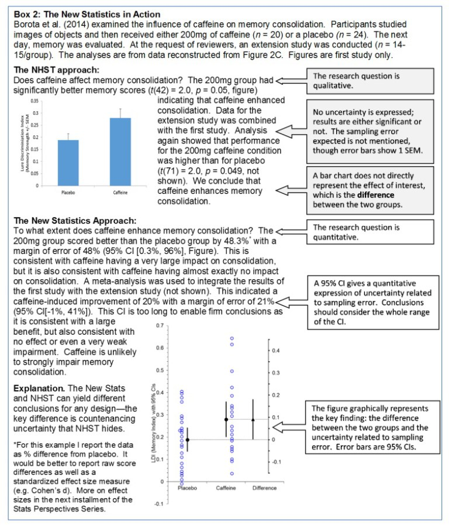

This summer I (Bob) was asked to write a series of perspective pieces on statistical issues for the [*Journal of Undergraduate Neuroscience*](http://www.funjournal.org/).

My first effort has [just been published](http://www.funjournal.org/wp-content/uploads/2017/10/june-16-e1.pdf)–it is a call for neuroscience education to shift away from *p* values, and an explanation of the basic principles of the New Statistics with an example drawn from neuroscience.

It turns out that the paper was published just before the annual meeting of the *Society for Neuroscience*, which I am currently attending.  It’s been very gratifying to see the paper is already sparking some discussion.

Here’s the key figure from the paper comparing/contrasting the NHST approach with the New Statistics approach with data from a paper in *Nature Neuroscience.*

