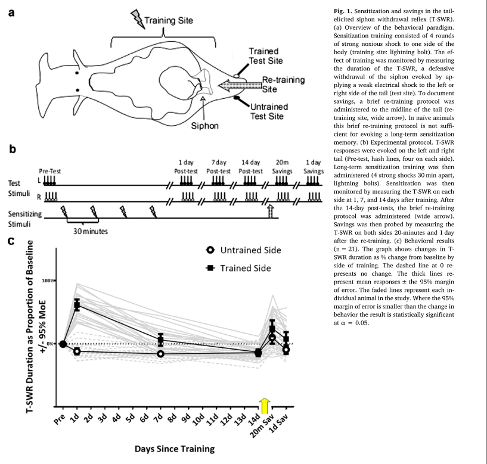
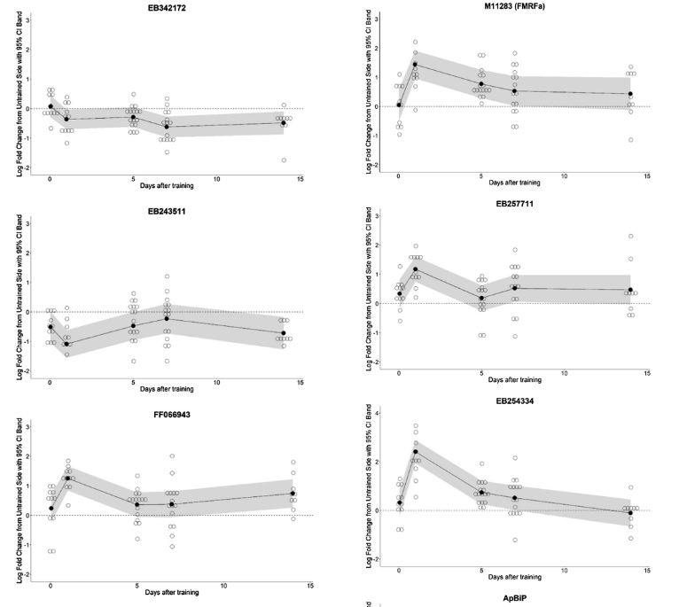

It was a whirlwind 2018. Irina and I are just now catching our breath and finding some time to update the lab website.

One awesome piece of news we forgot to publicize is that our latest paper came out in the August issue of *Neurobiology of Learning and Memory (Patel et al., 2018)*.   This paper continues our work of tracking the molecular fragments of a memory as it is forgotten.  Specifically, we tracked 11 genes we suspected of being regulated \*after\* forgetting (Perez, Patel, Rivota, Calin-Jageman, & Calin-Jageman, 2017).  Things didn’t work out quite as well as we had expected: of our 11 candidate genes 4 didn’t show much regulation, meaning that our previous results with these genes were probably over-estimating their importance (curse you, sampling error!).  On the other hand, we replicated the results with the other genes and found that some of them are actually regulated for up to **2 weeks**after the memory is induced, long after it seems forgotten.

Here are two key figures.  The first is the memory curve for sensitization in our *Aplysia*-it shows that after memory induction there is strong sensitization recall that decays within a week back to baseline.  Even though the memory seems gone, giving a reminder 2 weeks after learning rekindles a weak re-expression of the memory. That’s a classic “savings” effect.

The next figure traces the time-course of memory-induced gene expression (levels of mRNA) for 6 specific genes, measured in the pleural ganglia that contains neurons known to be important for storing sensitization memory.  You can see that each of these transcripts is up- or down-regulated within 24 hours of learning, and that in each case this regulation lasts at least a week and sometimes out to 2 weeks.  So, just as the behavioral level of the memory fades but isn’t really completely gone, the some of the transcriptional events that accompany learning also seem to persist for quite some time.

Why would this occur?  Perhaps these transcripts are part of savings…maybe they set the stage for re-expressing the memory?  Or maybe they are actually part of forgetting, working to remove the memory?  Or maybe both?  For example, one of the transcripts is encodes an inhibitory transmitter named FMRFamide.  It is really up-regulated by learning, which would normally work *against*the expression of sensitization memory.  So perhaps this helps suppress the memory (forgetting), but in a way that can be easily overcome with sufficient excitation (savings)… that’s an exciting maybe, and it’s the thing we’ll be working this summer to test.

As usual, we’re so proud that this paper was made possible through exceptional hard work from some outstanding DU student researchers: Ushma Patel, Leticia Perez, Steven Farrell, Derek Steck, Athira Jacob, Tania Rosiles, and Melissa Nguyen.  Go slug squad!

Patel, U., Perez, L., Farrell, S., Steck, D., Jacob, A., Rosiles, T., … Calin-Jageman, I. E. (2018). Transcriptional changes before and after forgetting of a long-term sensitization memory in Aplysia californica. *Neurobiology of Learning and Memory*, *155*, 474–485. doi:[10.1016/j.nlm.2018.09.007](https://doi.org/10.1016/j.nlm.2018.09.007)

Perez, L., Patel, U., Rivota, M., Calin-Jageman, I. E., & Calin-Jageman, R. J. (2017). Savings memory is accompanied by transcriptional changes that persist beyond the decay of recall. *Learning & Memory*, *25*(1), 45–48. doi:[10.1101/lm.046250.117](https://doi.org/10.1101/lm.046250.117)