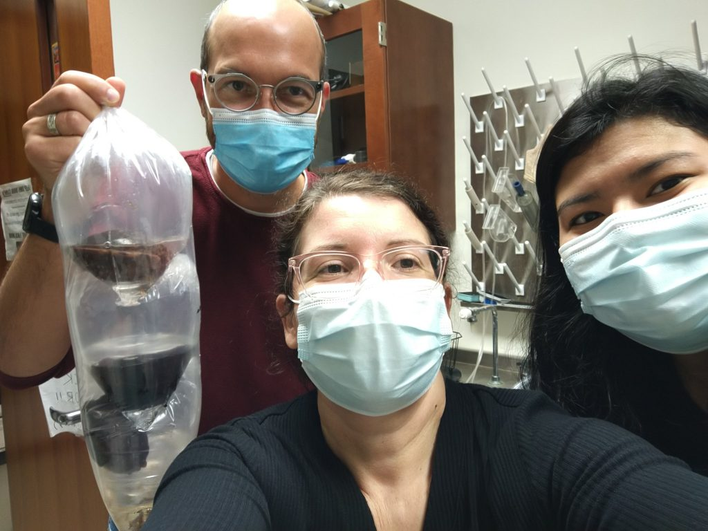

Today we received a shipment of *Aplysia*–the first shipment we’ve had since February of 2020.

It’s been a long, frustrating, and anxiety-ridden time for the animal colony to be empty. It’s not that the lab has been inactive–in fact, we published what I think is our best paper ever just a few months ago​1​ . But it has been a long stretch without being able to provide the our typical level of involvement and excitement for our student researchers in the slug lab.

It feels really good to know that we are getting back on track. In fact, in addition to welcoming new slugs we’ve welcomed 5 new lab members: Lucas Eggers, Cynthia Espino, Daniel Mason, Delaney Mcriley, & Steven Proutsos. They join continuing member Melissa Nguyen to round out the Fall 2021 edition of the Sluglab. Let’s kick some a\*\*! (scientifically)

First batch in a long time: Dr. Bob, Dr. C-J, and new lab member Cynthia Espino, October 2021

Our first project with this batch of animals will be to explore for epigenetic markers accompanying long-term sensitization.

Over the last summer, C-J has worked like crazy on protocols for measuring methylation. We’ve found that it is surprisingly easy to full yourself, to obtain signals due to non-specific binding. What we’ve settled on is a process to check specificity of primer sets exhaustively by using synthetic DNA that we can manually methylate. Using this approach we’re pretty sure a key CPG island in the CREB1 promoter is \*not\* methylated in either control or trained animals. And our summer results also identified a CPG island in the egr promoter that seems to be default methylated, but with no change after sensitization. Our goal with these new animals is to now survey other methylation sites in the promoters of highly learning-regulated transcripts. Having lab meetings back in person has been fantastic (masks, of course, and DU has a vaccine mandate which has been very well implemented); very excited to see where research involvement takes our latest batch of slug lab members.

1. 1.

   Rosiles T, Nguyen M, Duron M, et al. Registered Report: Transcriptional Analysis of Savings Memory Suggests Forgetting is Due to Retrieval Failure. *eNeuro*. Published online September 14, 2020:ENEURO.0313-19.2020. doi:[10.1523/eneuro.0313-19.2020](https://doi.org/10.1523/eneuro.0313-19.2020)