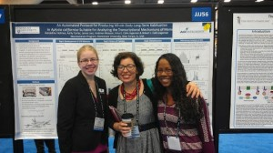
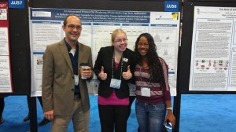

Congratulations, Gerry!  Junior DU student, bio major, and all-around Slug Lab superstar won a Faculty for Undergraduate Neuroscience Travel Award to attend this year’s Society for Neuroscience Meeting in San Diego, CA.  It was a competitive and international field, but Gerry nabbed one of these prestigious awards to present her ongoing work on the transcriptional mechanisms of long-term habituation.  Shown in the photo on the left is Gerry (left), Dr C-J (middle) and lab alumni Kristine Bonnick (right) who visisted the poster and the meeting from Loma Linda medical school where she is now enrolled.  In the photo on the right, Dr. Bob makes an appearance.  Go sluglab!

[](http://calin-jageman.net/lab/wp-content/uploads/2014/01/IMAG0776.jpg)