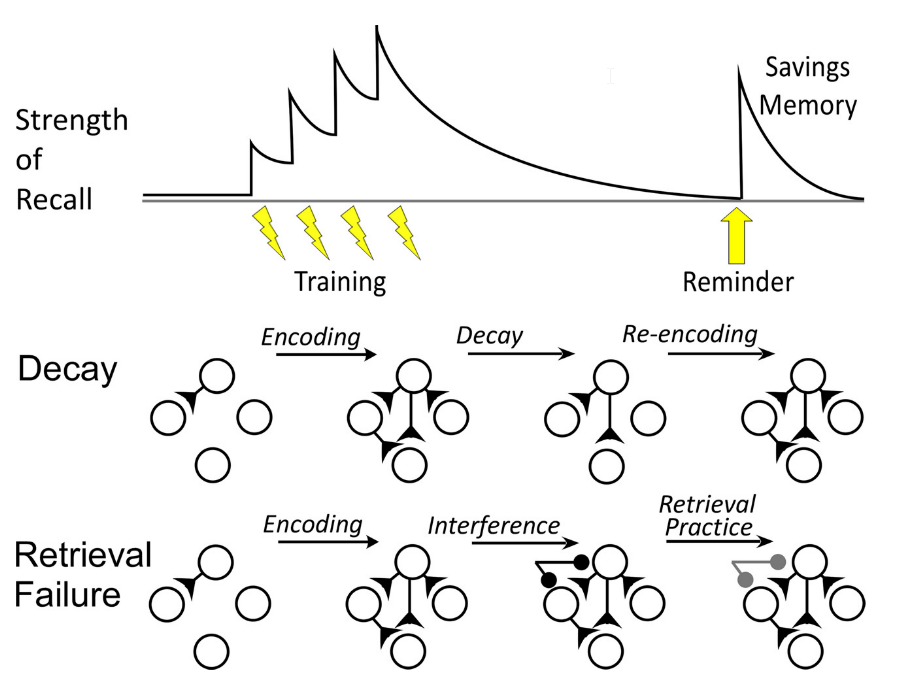
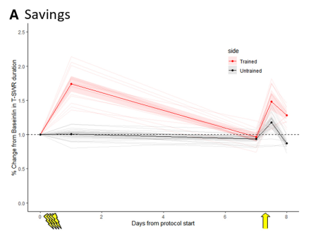
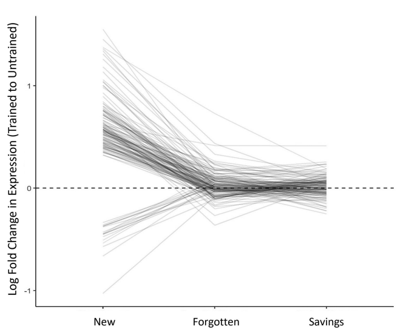

Today, the SlugLab can share an exciting new paper, with contributions from Tania Rosiles, Melissa Nguyen, Monica Duron, Annette Garcia, George Garcia, Hannah Gordon, and Lorena Juarez ​(Rosiles et al., 2020)​.

Where to even start?

* Contributions from 7 student co-authors! It’s been such a long haul; we’re proud of each of you for sticking with it and for all your contributions to this paper.
* This paper is a registered report: We first proposed the idea and the methods, even writing a complete analysis script. This was then sent to peer review (you know, when you can still do something if the reviewers turn up an issue or problem to consider!) and after some back and forth received an ‘in principle’ acceptance. *Then* we completed the work and the analysis and submitted it for one more round of review focused solely on the interpretation of the data. This approach to publication lets peer reviewers have a more meaningful impact on the project and it also helps combat publication bias. People tend to think of this model for replication research, but in our case we used a registered report because we wanted to establish a fair and valid test between two competing theories and to ensure that the approach and analysis were pre-specified.
* This paper is exciting! We were able to test two very different theories of forgetting:
  + decay theory, which says that memories are forgotten because they physically degrade
  + retrieval failure, which says that memories don’t degrade at all, but simply become more difficult to retrieve due to interference

We found clear support for the retrieval failure theory of forgetting, something I (Bob) was completely not expecting.

So, what was the study actually about?

Even memories stored via wiring changes in the brain can be forgotten. In fact, the majority of long-term memories are probably forgotten. What does this really mean? Is the information gone, or just inaccessible?

One clue is from savings memory, the fact you can very quickly re-learn seemingly-forgotten information. Savings memory is sometimes taken to mean the original memory trace persists, but it could also be that it had decayed, and the remnants prime re-learning.

We noticed a testable prediction:

* If forgetting is decay, savings re-encodes the memory and must involve the transcriptional and wiring changes used to store new information.
* If forgetting is inaccessibility, savings shouldn’t involve transcriptional/wiring changes

To test this prediction, we tracked transcriptional changes associated with memory storage as a memory was first formed, then forgotten, then re-activated. We did this in the sea slug, Aplysia calinfornica as a registered report (with pre-registered design and analyses).

The memory was for a painful shock—this is expressed as an increase in reflexes (day 1, red line way above baseline). Sensitization is forgotten in about a week (day 7, reflexes back to normal), but then a weak shock produces savings (day 8, reflexes jump back up)

What’s happening in the nervous system? Our key figure shows expression of ~100 transcripts that are sharply up- or down-regulated when the memory is new. At forgetting, these are deactivated (all lines dive towards 0). At savings? No re-activation! (lines stay near 0)

Our results show that savings re-activates a forgotten memory without invoking \*any\* of the transcriptional changes associated with memory formation. This strongly suggests the memory is not rebuilt, but just re-activated—the information must have been there all along?!

Lots of caveats (see paper), but the results seem compelling (though surprising) to us. In particular, we used an archival data set to show we would have observed re-activation of transcription had it occurred. Transcriptional changes with savings are clearly negligible.

1. Rosiles, T., Nguyen, M., Duron, M., Garcia, A., Garcia, G., Gordon, H., … Calin-Jageman, R. J. (2020). Registered Report: Transcriptional Analysis of Savings Memory Suggests Forgetting is Due to Retrieval Failure. Society for Neuroscience. doi: [10.1523/eneuro.0313-19.2020](https://doi.org/10.1523/eneuro.0313-19.2020)