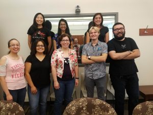
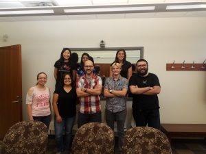

Quanta Magazine recently ran a feature article on the nature of forgetting.  The piece covers several new lines of research on forgetting, including the work we’ve been doing with *Aplysia*.  It’s a great piece, and it’s amazing to see strong public interest in our work.

[To Remember, the Brain Must Actively Forget by Dalmeet Singh, Quanta Magazine](https://www.quantamagazine.org/to-remember-the-brain-must-actively-forget-20180724/)

Of course, accolades like this would not be possible if it were not for our amazing students.  Here’s the lab enjoying our end-of-summer party.

 