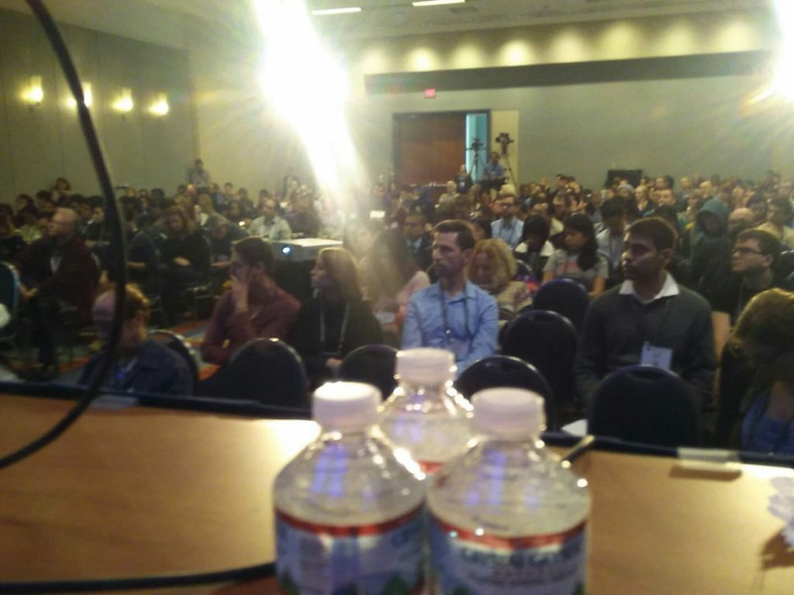

This year was a big year for our lab at the Society for Neuroscience conference.  Leticia Perez, who has been in the lab for the past two summers, gave [an amazing talk on our work on forgetting](https://calin-jageman.net/lab/an-unforgettable-experience-talking-about-forgetting/).  In addition, I (Bob) helped organize a Professional Development Workshop on doing better neuroscience.

It was a huge honor to get to lead this workshop.  I gave a presentation on sample-size planning (which is sooo vital to doing good science).  David Mellor at the Open Science Framework spoke about pre-registration.  And Richard Ball, who co-directs project Tier, spoke about reproducible data analysis.  Like the good Open Scientists we are, we used the Open Science Framework to post all our slides and resources: [https://osf.io/5awp4/.](https://osf.io/5awp4/) SFN also made a video, which should be posted soon.

SFN staff told us it was the best attended workshop for the meeting.  Hooray!  Hope all our attendees will go forth to spread the good word about these small tweaks that can have such a big impact on scientific quality.

Here’s what it looked like from my perspective:

