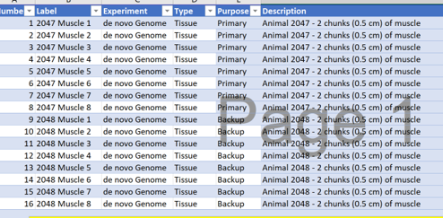
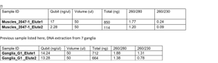
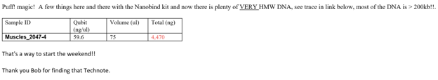
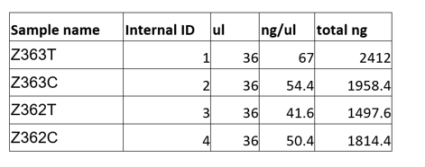

This page organizes resources from various *Aplysia* sequencing projects the Slug Lab has carried out in collaboration with the University of Illinois.

# Processed Files

## Long-Read Assembly of the *Aplysia* Genome

The long-read assembly we produced (DOMU_ApCal_1.1) is posted to NCBI: <https://www.ncbi.nlm.nih.gov/datasets/genome/GCA_041379995.1/>

The posted assembly does not include mitochondrial DNA.

You can BLAST this assembly at NCBI or from our sequence sever: <https://blast.aplysia.online>

## Annotations

To annotate the new genomic assembly, we:

- Used Liftoff to map the current NCBI annotation to the new assembly, release 102: <https://www.ncbi.nlm.nih.gov/refseq/annotation_euk/Aplysia_californica/102/> (see also the files NCBI has posted here: <https://ftp.ncbi.nlm.nih.gov/genomes/all/annotation_releases/6500/102>)

- Used Liftoff to map the current Ensembl annotation to the new assembly, the release last updated 11/2024: <https://beta.ensembl.org/species/264cff85-f586-4e0f-afd3-29ea13f42ef2>. (see also the files posted by Ensembl here: <https://ftp.ebi.ac.uk/pub/ensemblorganisms/Aplysia_californica/GCA_000002075.2/ensembl/geneset/2024_11/>)

- Created a de novo assembly using Braker (DomUCal de novo 2024). For this de novo assembly we pulled all the available short-read and expression data for *Aplysia* posted to NCBI (as of early 2025) and also included a run of IsoSeq from neuronal tissue.

We then used GffCompare to cross-reference these annotations, marking the new annotation with matches to the NCBI and Ensembl annotations and the lifted-over NCBI and Ensembl annotations with matches to the *de novo annotation*.

You can explore these annotation in the genome browser we host: <https://jbrowse.aplysia.online>

You can download these annotation files here (links, for now, are via Dropbox; TBD: post to an stable archive that provides DOIs):

- [ncbi_apcal102_lifted_crossreferenced.gff3](https://www.dropbox.com/scl/fi/t5q4lntz89304a9igpnoj/ncbi_apcal102_lifted_crossreferenced.gff3?rlkey=odiz1o3xrtzz4o8hu869coxj7&dl=0)

- [ensembl_2024_11_lifted_crossreferenced.gff3](https://www.dropbox.com/scl/fi/t4xq92khp8jqz90om66c2/ensembl_2024_11_lifted_crossreferenced.gff3?rlkey=up6g97b9znlo5dxowfm5hior4&dl=0)

- [domucal_de_novo_2025_crossreferenced.gff3](https://www.dropbox.com/scl/fi/n5dys7wtzsrojow2okjts/domucal_de_novo_2025_crossreferenced.gff3?rlkey=h1ly96ebnfiftsgiq4au35lde&dl=0)

## Additional Sequence Data

TBD: Post extracted CDS and predicted protein sequences for each annotation.

# Raw Reads

Downloads are provided via DropBox. If you find a bad link or an inaccessible file, please let us know.

You are welcome to pull these files for your own analyses and projects; please cite this page (or our pending paper describing these projects once we finally get it posted).

## Genomic Sequencing

Genomic sequencing was completed from muscle tissue isolated from the body wall. Animals were anesthetized, chunks of body wall tissue were quickly extracted and then flash frozen. Samples were collected on 6/27/2023 (after a failed attempt to extract from nervous system tissue) from two animals, with the intention of using one for sequencing and one as a backup. Animal 2047 ended up being used for all genomic sequencing.

First attempt at extraction did not yield desired outputs:

We found a technical note from PacBio with specific recs for Aplysia. It doesn't seem to be posted anymore (?), but is still mentioned [here](https://www.google.com/url?sa=t&source=web&rct=j&opi=89978449&url=https://www.pacb.com/wp-content/uploads/Overview-Nanobind-HMW-DNA-extraction-overview.pdf&ved=2ahUKEwiZxt2a96yVAxVm8MkDHWfqABQQFnoECBcQAQ&usg=AOvVaw1OMv1DosXjUrpzuXx9wIAO) (and also see: [@Alberola-Mora2025]). The tweaks suggested from PacBio led to very successful extraction:

### First Run

File: [UIC_Genomics_Aplysia_1_m64108e_230727_144537.hifi_reads.bam    39.51 GB](https://www.dropbox.com/scl/fi/ipo8wfidm3qsg4ka4brit/UIC_Genomics_Aplysia_1_m64108e_230727_144537.hifi_reads.bam?rlkey=5cj9vlwcmwqo0fh36wwjvwugh&st=1z5ad68a&dl=0)\
File: [UIC_Genomics_Aplysia_1_m64108e_230727_144537.hifi_reads.fastq.gz    8.37 GB](https://www.dropbox.com/scl/fi/ss8ar3s6dqeub6my5yeiu/UIC_Genomics_Aplysia_1_m64108e_230727_144537.hifi_reads.fastq.gz?rlkey=skaows05gk3az4941i32uyaf5&st=a0a21on1&dl=0)\
File: [UIC_Genomics_Aplysia_2_m64108e_230729_002218.hifi_reads.bam    39.66 GB](https://www.dropbox.com/scl/fi/1ch0f51w00z23o6z01h6v/UIC_Genomics_Aplysia_2_m64108e_230729_002218.hifi_reads.bam?rlkey=t30rcpg36tte29hi7dj4oimer&st=o8wzhmce&dl=0)\
File: [UIC_Genomics_Aplysia_2_m64108e_230729_002218.hifi_reads.fastq.gz    8.48 GB](https://www.dropbox.com/scl/fi/61veu88y02er9i4c6gm6f/UIC_Genomics_Aplysia_2_m64108e_230729_002218.hifi_reads.fastq.gz?rlkey=yj20dmli3x7d36mhhu0ih6gmc&st=0cb2yqfj&dl=0)

Summary report: [UIC_Genomics_Aplysia_HiFi_report_20230731.xlsx](https://www.dropbox.com/scl/fi/i1uhz1dhzen7lu8i435a5/UIC_Genomics_Aplysia_HiFi_report_20230731.xlsx?rlkey=trx0e01zlyvnt7pcps85x8zla&st=ohv5m0jw&dl=0)

The output was lower than we expected, with each SMRTcell only producing 11Gb with mean read lengths of 10kb.

### Second Run

The two new SMRTcells are ready. These two produced a total of just over 23Gb of CCS data with mean read lengths of 10kb, so they performed the same as the previous run.

File: [UIC_Genomics_Aplysia_3_m64108e_230821_183234.hifi_reads.bam    42.68 GB](https://www.dropbox.com/scl/fi/73ti6wmz75g1aq2h9g1ag/UIC_Genomics_Aplysia_3_m64108e_230821_183234.hifi_reads.bam?rlkey=ncq2wjmr3sezvijik04tsnsmg&st=ji0w04cg&dl=0)\
File: [UIC_Genomics_Aplysia_3_m64108e_230821_183234.hifi_reads.fastq.gz    9.17 GB](https://www.dropbox.com/scl/fi/c8kemgjwfks4bmv6b4hxl/UIC_Genomics_Aplysia_3_m64108e_230821_183234.hifi_reads.fastq.gz?rlkey=1og578dhqec33oq4iwao7rmdr&st=fy1oup78&dl=0)\
File: [UIC_Genomics_Aplysia_4_m64108e_230823_033821.hifi_reads.bam    39.75 GB](https://www.dropbox.com/scl/fi/xco466fknclv9hlrobm81/UIC_Genomics_Aplysia_4_m64108e_230823_033821.hifi_reads.bam?rlkey=mr1ubqu63ttta8jhf76djy10y&st=c03219dx&dl=0)\
File: [UIC_Genomics_Aplysia_4_m64108e_230823_033821.hifi_reads.fastq.gz    8.61 GB](https://www.dropbox.com/scl/fi/1knugfj5b0mgwqsjvs9w2/UIC_Genomics_Aplysia_4_m64108e_230823_033821.hifi_reads.fastq.gz?rlkey=l2w9826ahy2x7n7m7w0mga16k&st=vckahy7g&dl=0)

Summary report: [UIC_Genomics_Aplysia_HiFi_report_20230824.xlsx](https://www.dropbox.com/scl/fi/o6a2c730h7whkbu4493pq/UIC_Genomics_Aplysia_HiFi_report_20230824.xlsx?rlkey=qrh52y9vtskfjhmv7nxqzh8a6&st=eq0g4m7t&dl=0)

## OmniC and Tellseq

We conducted Tell-SEQ from material extracted from muscle samples of animal 2047, the same animal used for the long-read genomic sequencing above.

We conducted OmniC from material extracted from muscle samples of animal 2048, as there was no longer sufficient material for this analysis from animal 2047.

File: MultiQC_UICGenomics_Aplysia_OmniC_2023924.html    \<1 GB\
File: QC_Analysis_Aplysia_Muscles_nobc.html    \<1 GB\
File: UICGenomics_Aplysia_OmniC_2023924.tar.bz2    93.89 GB\
File: UICGenomics_TellSeq_2023926.tar.bz2    171.1 GB

Summary report: [Report_UICGenomics_OmniC_TellSeq_2023926.xlsx](https://www.dropbox.com/scl/fi/fuag7ob6bqcrgz8wfiq4j/Report_UICGenomics_OmniC_TellSeq_2023926.xlsx?rlkey=gck85s5cnvmjyz8uti0ecmqf8&st=sly46hbu&dl=0)

And the 3 OmniC libraries and one TellSeq libraries are ready. As a reminder, the TellSeq are from the same animal used for the Pacbio libraries, the OmniC are from a different animal.

They were sequenced in a 10B lane in a NovaSeq X Plus and produced over 2 billion reads with great quality scores.

## Methylation-Specific Sequencing

File: [Aplysia_2_EMSeq.2023713.tar.bz2    40.38 GB](https://www.dropbox.com/scl/fi/x3xpklnb9so9r0yrab8as/Aplysia_2_EMSeq.2023713.tar.bz2?rlkey=ly2o34bib10bdkukeeg2hpv4q&st=zz49yqlk&dl=0)\
File: [Project_Aplysia_2_EMSeq_multiqc_report.html    \<1 GB](https://www.dropbox.com/scl/fi/tlutc6mhtvj7ji9f5b6ut/Project_Aplysia_2_EMSeq_multiqc_report.html?rlkey=39okgpt011szir0r3rchbbxfr&st=3d3kota5&dl=0)

Summary report: [Report_Aplysia_2_EMSeq_2023713.xlsx](https://www.dropbox.com/scl/fi/log0kiun5xkx31v3ukkz2/Report_Aplysia_2_EMSeq_2023713.xlsx?rlkey=xdjfts6p47isugkluv7i9krmf&st=t6hlfb4j&dl=0)

The methylation libraries have been sequenced on an SP lane with 2x150nt reads and produced over 720 million reads with great quality scores.

## PacBio Long-Read Transcriptome from Pleural Ganglia

Samples were prepared on 6/7/2023:

- Four animals underwent standard long-term sensitization training (4 rounds of painful shocks, each round a train of 0.5 ms 90 mA 60hz shocks at an ISI of 1 minute.

- One day after training, animals were anesthetized and pleural ganglia were rapidly harvested. We combined tissue from 2 animals, one left-trained and 1 right-trained. The trained sample contained the left-pleural ganglion from the left-trained animal and the right pleural ganglia from the right-trained animal. The control sample contained the right-pleural ganglion from the left-trained animal and the left pleural ganglion from the right-trained animal.

- Ganglia were homogenized and RNA was then extracted:

Sample Z362 was selected for sequencing.

File: [UIC_GENOMICS_Z362T_Trained_hq_transcripts.fasta    0.49 GB](https://www.dropbox.com/scl/fi/osorvxv5x92fb2sfu9f3i/UIC_GENOMICS_Z362T_Trained_hq_transcripts.fasta?rlkey=nfzldgkrprbtjsrcumw8z8h3p&st=t3hzx6my&dl=0)\
File: [UIC_GENOMICS_Z362T_Trained_m64108e_230619_050826.hifi_reads.bam    32.05 GB](https://www.dropbox.com/scl/fi/cqmup29fnuqn21uaty9s1/UIC_GENOMICS_Z362T_Trained_m64108e_230619_050826.hifi_reads.bam?rlkey=npfuntcv6u6mqonb0gyulm30u&st=xbyms8p5&dl=0)\
File: [UIC_GENOMICS_Z362T_Trained_m64108e_230619_050826.hifi_reads.fastq.gz    4.13 GB](https://www.dropbox.com/scl/fi/q8s02vbtmg3ff7h1ktgfl/UIC_GENOMICS_Z362T_Trained_m64108e_230619_050826.hifi_reads.fastq.gz?rlkey=vk9hunmtird14v60svz6fwfs6&st=jlmprk7p&dl=0)\
File: [UIC_Genomics_Z362C_Control_hq_transcripts.fasta    0.47 GB](https://www.dropbox.com/scl/fi/pyecmubnxd2rddi4whbg1/UIC_Genomics_Z362C_Control_hq_transcripts.fasta?rlkey=29ue9dz3hx8s15uqkqoyunv7z&st=rjukkmba&dl=0)\
File: [UIC_Genomics_Z362C_Control_m64108e_230620_143829.hifi_reads.bam    29.86 GB](https://www.dropbox.com/scl/fi/8sug93s719iyds9cfia7o/UIC_Genomics_Z362C_Control_m64108e_230620_143829.hifi_reads.bam?rlkey=a9vhgijh363ao1ps8559knou8&st=zkvh5di0&dl=0)\
File: [UIC_Genomics_Z362C_Control_m64108e_230620_143829.hifi_reads.fastq.gz    3.89 GB](https://www.dropbox.com/scl/fi/9wyrynkqt2ubi45n7kfi3/UIC_Genomics_Z362C_Control_m64108e_230620_143829.hifi_reads.fastq.gz?rlkey=8snaqtvru0qj21j1o0vpkpl8s&st=5i6z30hr&dl=0)

Summary report: [UIC_GENOMICS_Z362T_Trained_and_Control_Isoseq_report_20230623.xlsx](https://www.dropbox.com/scl/fi/obdrcmmwzzlkv9btrbfn0/UIC_GENOMICS_Z362T_Trained_and_Control_Isoseq_report_20230623.xlsx?rlkey=qyuudid4jb19l04c92i00kj9s&st=awljkxzz&dl=0)

The Control and Trained RNAs have been converted into IsoSeq libraries and each was sequenced on a Pacbio SMRT cell. Each sample produced over 2.7 million reads, with over 127k individual transcripts. 

The transcript lengths are impressive, with most of them being 2-6kb, the longest I have seen.

The clustered transcripts are an immediate new resource, very exciting!
